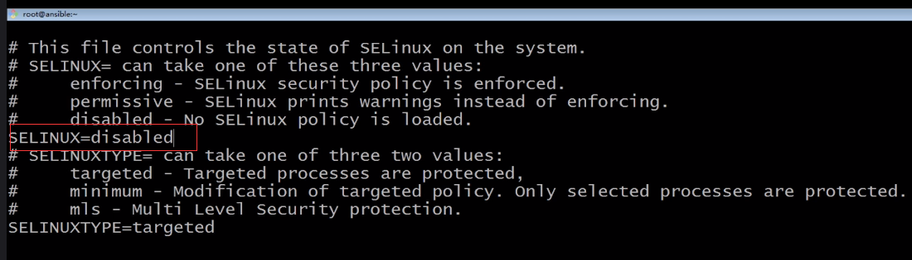
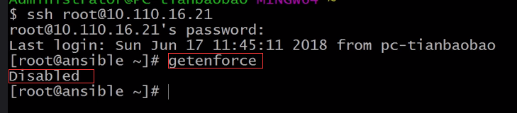

# verturalenv安装ansible 部署
## 新建ansible虚拟机
## 连接虚拟机
```
ssh root@192.168.11.129
```
## 关闭防火墙
```
systemctl stop firewalld
```
## 禁用防火墙
```
systemctl disable firewalld
```

## 编辑selinux，禁用强制安全访问策略
```
vi /etc/sysconfig/selinux
```


## 重启使禁令生效
```
reboot
```

## 查看禁令是否生效



## 下载python安装包
```
wget http://www.python.org/ftp/python/3.6.5/Python-3.6.5.tar.xz
```

## 解压python安装包
```
tar xf Python-3.6.5.tar.xz
```

## 进入解压目录
```
cd Python-3.6.5
```

## 设定编译参数值
```
 ./configure --prefix=/usr/local --with-ensurepip=install --enable-shared LDFLAGS="-Wl,-rpath /usr/local/lib"
```

--prefix=usr/local 将Python安装到usr/local目录下

--with-ensurepip=install 安装pipinstall

## 完成编译并将编译好的文件安装到usr/local目录下
```
make && make altinstall
```

### can't decompress data; zlib not available错误解决办法
```
1.安装依赖zlib、zlib-devel
yum install zlib zlib
yum install zlib zlib-devel
```

## 查看pip3.6安装路径
```
which pip3.6
```


## 给pip3.6做一个软链接
```
ln -s /usr/local/bin/pip3.6 /usr/local/bin/pip
```

## pip安装virtualenv
```
 pip install virtualenv
```

### 错误处理

```
pip is configured with locations that require TLS/SSL, however the ssl module in Python is not avail
```

解决方法
```
查看openssl安装包，发现缺少openssl-devel包

[root@localhost ~]# rpm -aq|grep openssl

openssl-0.9.8e-20.el5

openssl-0.9.8e-20.el5

[root@localhost ~]#

yum安装openssl-devel

[root@localhost ~]# yum install openssl-devel -y

查看安装结果

[root@localhost ~]# rpm -aq|grep openssl

openssl-0.9.8e-26.el5_9.1

openssl-0.9.8e-26.el5_9.1

openssl-devel-0.9.8e-26.el5_9.1

openssl-devel-0.9.8e-26.el5_9.1

重新编译python
```

## 创建一个ansible账户
```
 useradd deploy
```

## 登陆deploy用户的命令行
```
  su - deploy
```

## 在deploy用户下创建一个python3.6版本的deploy实例
```
  virtualenv -p /usr/local/bin/python3.6 .py3-a2.5-env
```

## 进入实例目录
```
  cd /home/deploy/.py3-a2.5-env
```

## 返回root用户安装git
```
  su - root
  yum -y install git nss curl
```
## 切换deploy克隆ansible代码
```
  su - deploy
   git clone https://github.com/ansible/ansible.git
```

## 加载python3.6 vertualenv环境
```
   source /home/deploy/.py3-a2.5-env/bin/activate
```

## 安装ansible依赖包
```
    pip install paramiko PyYAML jinja2
```

## 移动ansible源码到指定文件夹下
```
    mv ansible .py3-a2.5-env/
```

## 进入ansible源码到指定文件夹下
```
    cd .py3-a2.5-env/ansible/
```

## 切换到2.5分支下
```
    git checkout stable-2.5
```

## 在此虚拟环境下加载2.5版本
```
     source /home/deploy/.py3-a2.5-env/ansible/hacking/env-setup -q
```

## 验证是否安装成功
```
ansible --verison
```