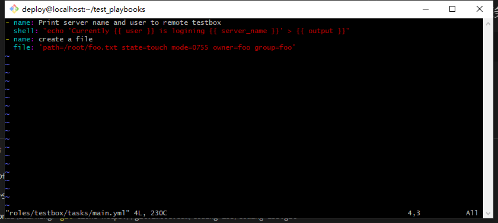

# ansible常用模块测试
## 登陆ansible服务器
 ```
 ssh root@192.168.11.129
 ```

## 切换至deploy用户
 ```
su - deploy
 ```
 
## 切换至deploy用户
 ```
source .py3-a2.5-env/bin/activate
 ```

 ## 加载ansible2.5版本
 ```
source .py3-a2.5-env/ansible/hacking/env-setup -q
 ```
 ### 验证加载效果

```
 ansible-playbook --version
```


## 配置目标主机
### 登陆目标主机
```
ssh root@test.example.com
```

### 创建系统用户
```
useradd deploy
useradd foo
```
### 安装nginx yum源
```
rpm -Uvh http://nginx.org/packages/centos/7/noarch/RPMS/nginx-release-centos-7-0.el7.ngx.noarch.rpm
```
### 退出
```
exit
```
## 修改main.yml任务文件
 ```
vi roles/testbox/tasks/main.yml
 ```
 