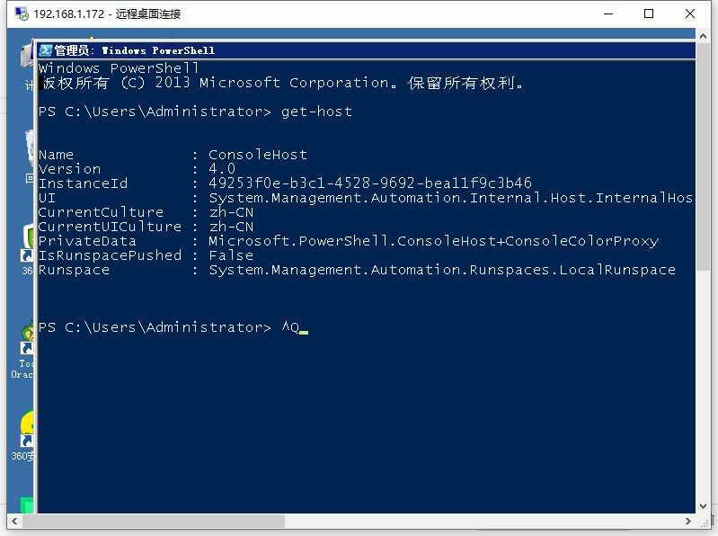
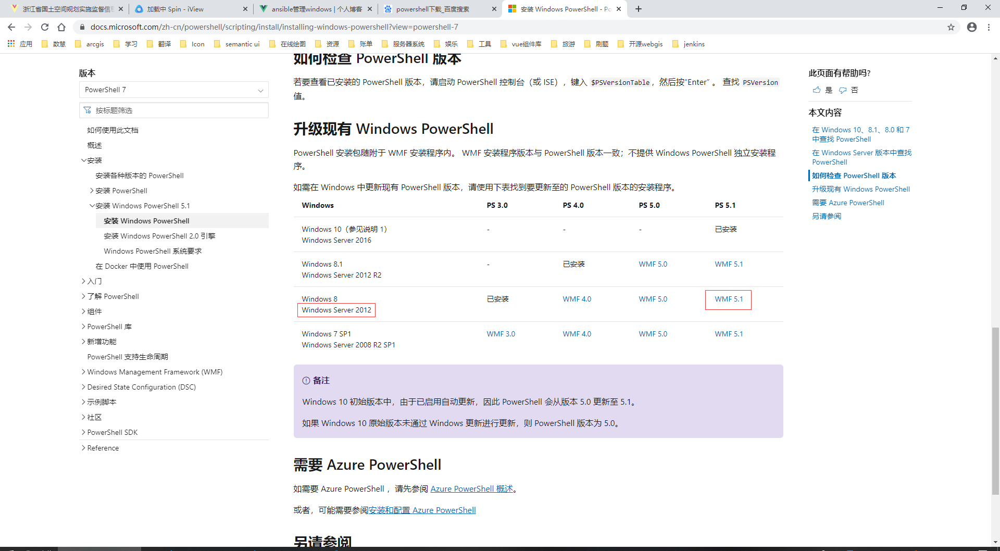
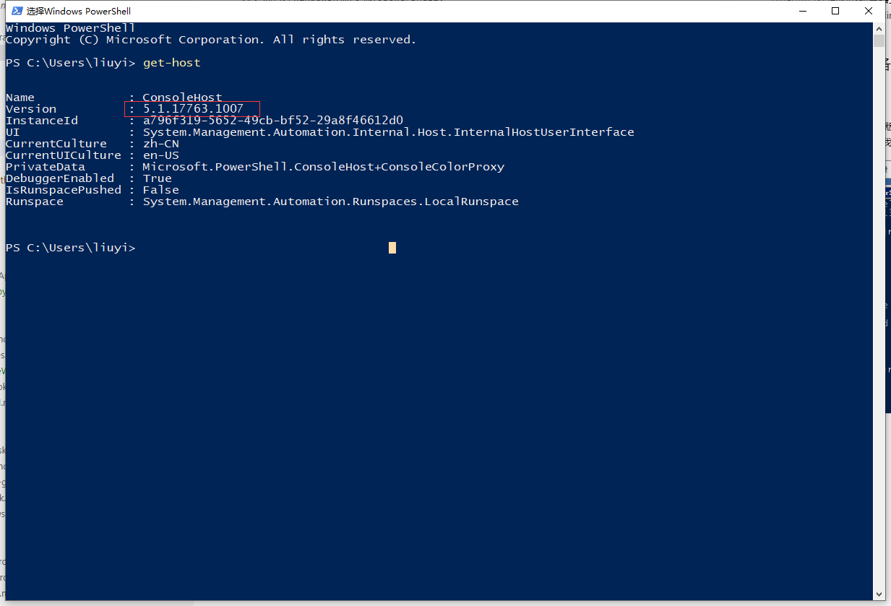
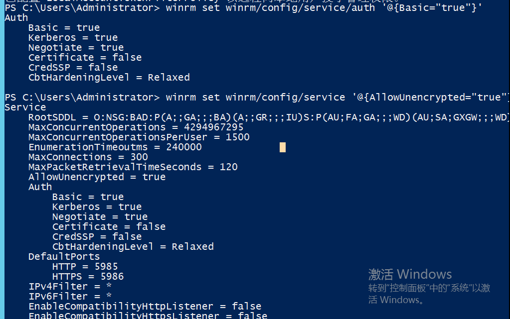

# ansible 管理 windows

gitlab 项目在 jenkins 服务器上构建打包完成后，需要发布到指定服务器上，jenkins 需要对相应服务器进行部署操作。ansible 管理 linux 相对容易，因为 linux 自带 ssh 无需配置相关环境。而管理 windows 则需要通过 powershell。

## windows 环境准备

### 升级 powershell 版本

`get-host`查看 powershell 版本
最好升级到 5 以上，目前不清楚是不是 powershell 版本的问题，ansible 操作 windows 特别慢，操作我电脑上的 windows 虚拟机很快，我本地 windows 虚拟机是 5.1.

<div align=center>
	
</div>

[下载地址](https://docs.microsoft.com/zh-cn/powershell/scripting/install/installing-windows-powershell?view=powershell-7)
选择远程服务器系统所对应的版本，我的远程服务器是 windows2012r2

<div align=center>
	
</div>

升级完成查看版本

<div align=center>
	
</div>

### 配置 winrm 服务

Windows 上 winrm 服务默认是未启用的，使用如下命令可以查看状态

```
winrm enumerate winrm/config/listener
```

<div align=center>
	
</div>

使用如下命令配置 winrm 服务

```
winrm quickconfig
winrm set winrm/config/service/auth '@{Basic="true"}'
winrm set winrm/config/service '@{AllowUnencrypted="true"}'
```

<div align=center>
	
</div>

至此，windows主机的配置就完成了，接下来我们配置linux管理节点进行验证。

## ansible服务器环境配置

### 使用pip安装pywinrm模块

```
pip install pywinrm
```

### 配置hosts文件

文件路径: ```/etc/ansible/hosts```

配置示例

```
[wind]
192.168.247 ansible_ssh_user="Administrator" ansible_ssh_pass="NPS#2018" ansible_ssh_port=5985 ansible_connection="winrm" ansible_winrm_server_cert_validation=ignore
```

然后使用如下命令进行验证，我们看到，此时可以使用win_ping模块连到之前配置的windows主机上了。

```
[root@cmdb-server ansible]# ansible wind -m win_ping
192.168.247.151 | SUCCESS => {
    "changed": false,
    "ping": "pong"
}
```

### 常用操作widows命令
```
Windows下可用模块虽不及Linux丰富，但基础功能均包括在内，以下几个模块为常用模块：
win_acl (E) —设置文件/目录属主属组权限；
win_copy—拷贝文件到远程Windows主机；
win_file —创建，删除文件或目录；
win_lineinfile—匹配替换文件内容；
win_package (E) —安装/卸载本地或网络软件包；
win_ping —Windows系统下的ping模块，常用来测试主机是否存活；
win_service—管理Windows Services服务；
win_user —管理Windows本地用户。

window的通信检测为：ansible testwin -m win_ping
 
复制文件到window：
ansible windows -m win_copy -a "src=/etc/passwd dest=E:filepasswd"
 
删除文件：
ansible windows -m win_file -a "path=E:filepasswd state=absent"
 
新增用户：
ansible windows -m win_user -a "name=stanley password=magedu@123 groups=Administrators"
 
重启服务：
ansible windows -m win_service -a "name=spooler state=restarted"
 
获取window主机信息：
ansible windows -m setup
 
执行ps脚本：
ansible windows -m script -a "E://test.ps1"
 
获取IP地址：
ansible windows -m win_command -a "ipconfig"
 
查看文件状态：
ansible windows -m win_stat -a "path='C://Windows/win.ini'"
 
移动文件：
ansible windows -m raw -a "cmd /c 'move /y d:\issue c:\issue'"
 
创建文件夹：
ansible windows -m raw -a "mkdir d:\tst"
 
重启：
ansible windows -m win_reboot
 
结束程序：
ansible windows-m raw -a "taskkill /F /IM QQ.exe /T"
 
如果window主机传回来的中文是乱码，则修改ansible控制机上的python编码：
sed -i "s#tdout_buffer.append(stdout)#tdout_buffer.append(stdout.decode('gbk').encode('utf-8'))#g" /usr/lib/python2.6/site-packages/winrm/protocol.py
sed -i "s#stderr_buffer.append(stderr)#stderr_buffer.append(stderr.decode('gbk').encode('utf-8'))#g" /usr/lib/python2.6/site-packages/winrm/protocol.py
 
指定配置文件获取win网卡信息
ansible -i win_hosts windows -m raw -a "ipconfig"
  
使用默认的配置文件获取网卡信息
ansible windows -m raw -a "ipconfig"
  
拷贝文件到远程Windows主机
ansible windows -m win_copy -a 'src=/etc/passwd dest=F:\file\passwd'
  
ansible windows -m win_copy -a "src=/usr/local/src/PayChannels20.35.zip dest=D:\Tomcat8630\webapps\PayChannels20.35.zip"
  
ansible windows -m win_copy -a "src=/usr/local/src/SupplierPay.zip dest=D:\SupplierPay.zip
  
将.zip解压到远程Windows主机，远程主机上必须存在需要解压的源文件
ansible windows -m win_unzip -a"creates=no src=D:\Tomcat8620\webapps\PayChannels-8630.zip dest=D:\Tomcat8620\webapps"
解压到D盘：ansible windows -m win_unzip -a"creates=no src=D:\SupplierPay.zip dest=D:"
  
  
重启远程windows主机的服务
ansible windows -m win_service -a "name=Tomcat8630 state=restarted"
重启node.js(.bat命令)
ansible windows -m win_command -a "chdir=D:\SupplierPay .\http_restart.bat"
 
执行win_command模块命令
启动redis
ansible windows -m win_command -a "chdir=D:\Redis server-start.bat "
 
ansible win -m win_command -a "chdir=C:\ a.bat "
ps:"chdir=C:\ a.bat " 之前有空格
 
删除文件或者目录
ansible windows -m win_file -a "dest=D:\Tomcat8630\log\ state=absent"
ansible windows -m win_file -a "dest=D:\Tomcat8630\logs\ state=absent"
  
创建用户
ansible windows -m win_user -a "name=aa passwd=123456"
  
创建一个名叫user1的管理员用户，要求能够远程访问
ansible windows -m win_user -a "name=user1 password=123 groups='Administrators,Remote Desktop Users'"
  
重启的第一种方式
ansible windows -m win_shell -a "shutdown -r -t 1"
 
重启的第二种方式
ansible windows -m win_reboot
获取ip地址
 
ansible windows -m raw -a "ipconfig"
 
获取身份
 
ansible windows -m win_command -a "whoami"
 
移动文件
 
ansible windows -m raw -a "cmd /c 'move /y D:\Ansible\product\DBFPlus.exe D:\Ansible\back\'"
 
移动文件目标端也需要制定到文件，而不能只制定到所在目录位置
 
ansible windows -m raw -a "cmd /c 'move /y D:\Ansible\product D:\Ansible\back'"
 
移动文件夹源端和目标端目录都不能带反斜杠/。且将源的整个目录移到目的端目录里。
 
创建文件夹
 
ansible windows -m raw -a "md d:\Ansible\justin"
 
删除文件或目录
 
ansible windows -m win_file -a "path=d:\Ansible\justin state=absent"
 
结束某程序
 
ansible windows -m raw -a "taskkill /F /IM snmp.exe /T"
 
文件传输
 
ansible windows -m win_copy -a 'src=/app/svn/127_Client/118919/zjcfg.zip dest=D:\soft\'
```