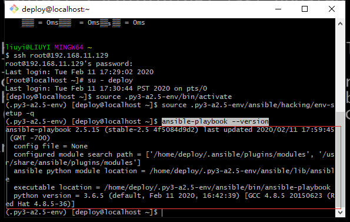
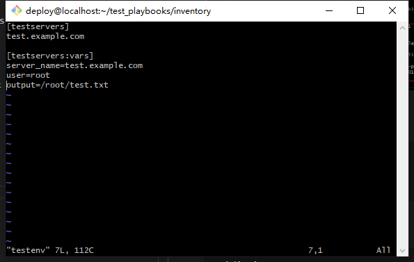
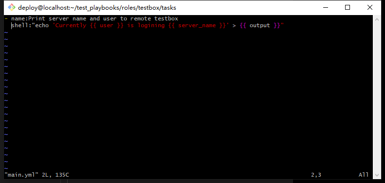
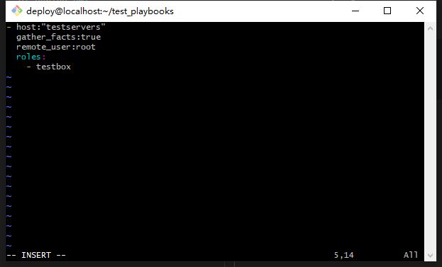
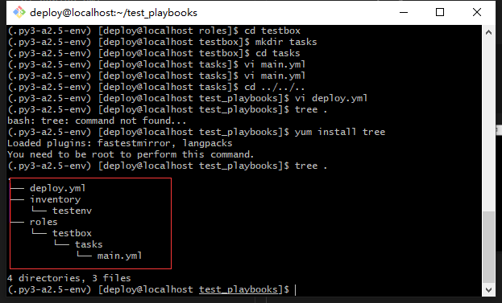
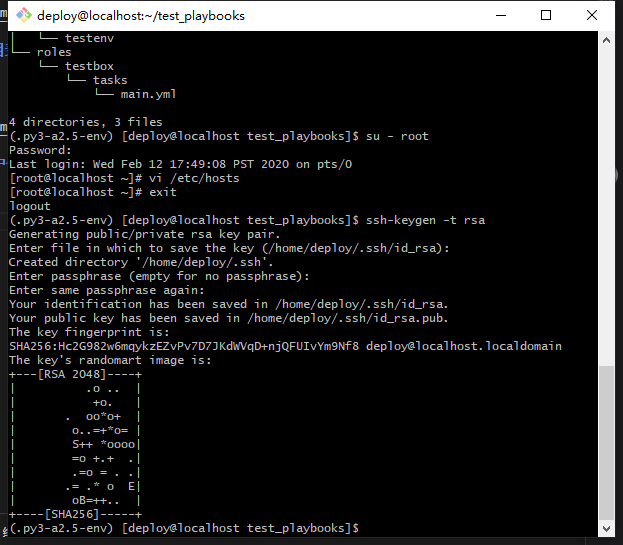
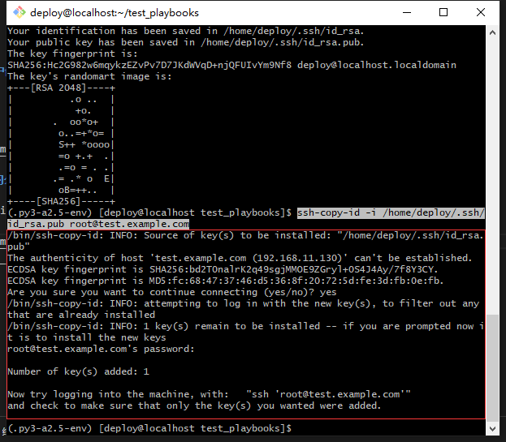
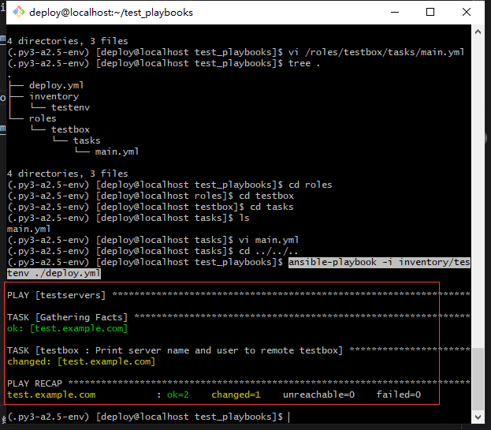

# ansible-playbooks编写规范

## 登陆并切换至deploy用户

```
 ssh root@192.168.11.129
 su - deploy
```

## 加载python3.6的虚拟环境

```
 source .py3-a2.5-env/bin/activate
```
## 加载ansible2.5

```
 source .py3-a2.5-env/ansible/hacking/env-setup -q
```

### 验证加载效果

```
 ansible-playbook --version
```


## 创建并进入test_playbook目录
```
 mkdir test_playbooks

 cd test_playbooks
```

## 创建相应目录及文件
```
 mkdir inventory
 
 mkdir roles

 cd inventory/

 vi testenv
```


## 创建相应目录及主任务文件
```
 cd ..

 cd roles
 
 mkdir testbox

 mkdir testbox

 cd testbox

 mkdir tasks

 cd tasks

 vi main.yml
```


## 回到test_playbook目录下创建任务文件
```
 cd ../../..

 vi deploy.yml
```



## 检查创建的目录结构
```
 tree .
```


## 返回root用户修改hosts文件
```
 su - root
 vi /etc/hosts
```

## 退出root用户创建ssh密钥
```
 exit
 ssh-keygen -t rsa
```


## 将本地创建的公钥传送到目标主机
```
 ssh-copy-id -i /home/deploy/.ssh/id_rsa.pub root@test.example.com
```


## 执行任务
```
 ansible-playbook -i inventory/testenv ./deploy.yml
```
