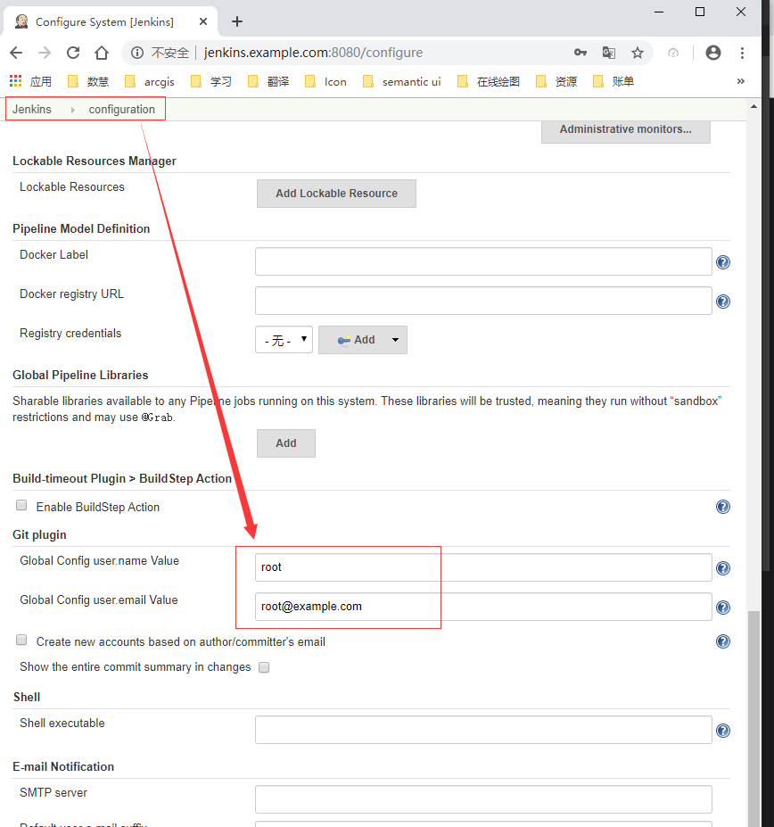
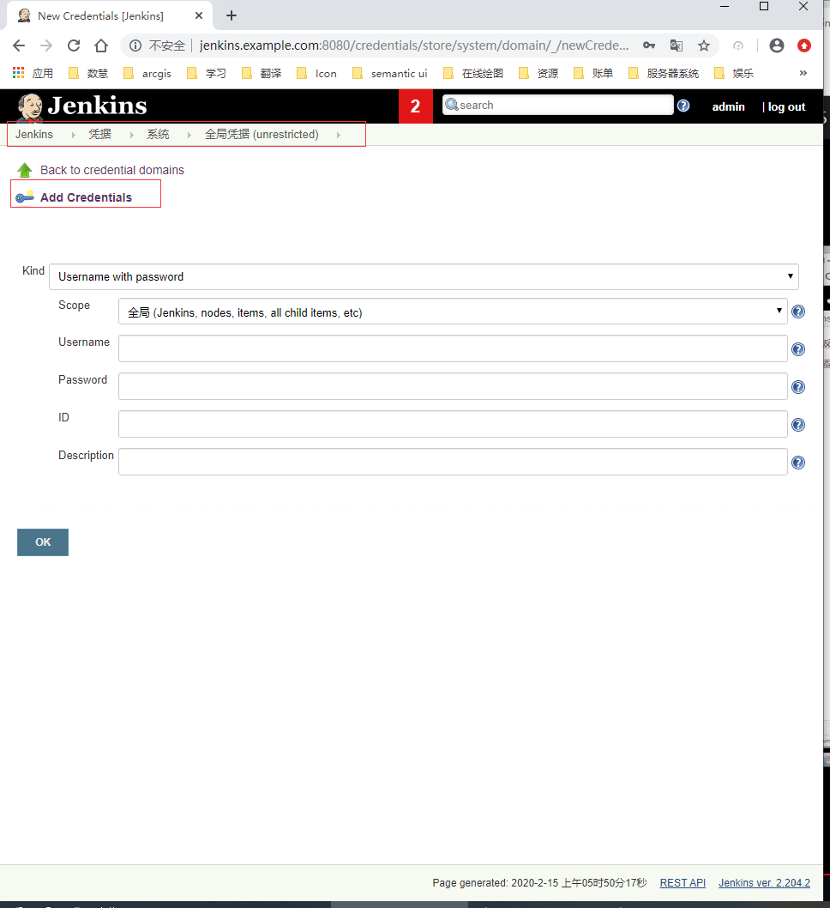
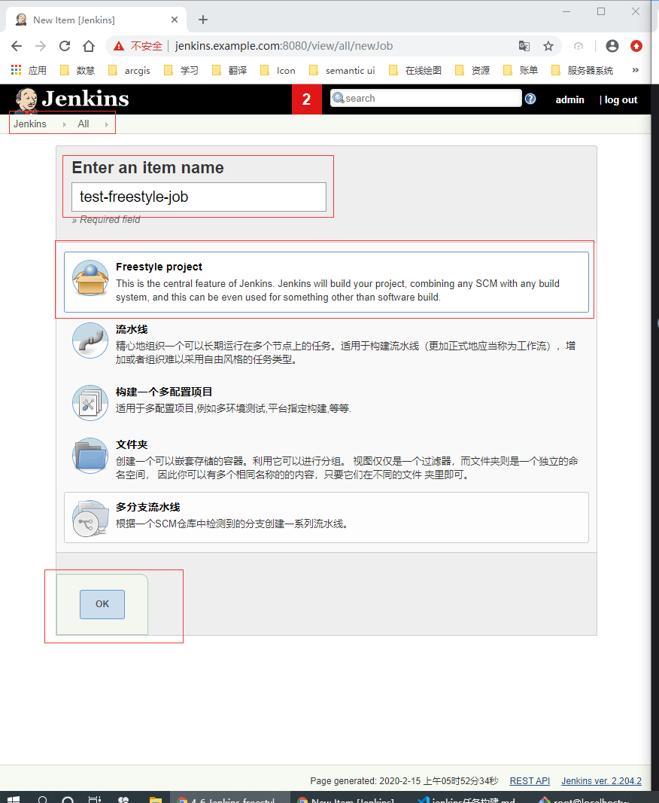

# Jenkins任务构建

## 登录jenkins服务器
```
ssh root@jenkins.example.com
```

## 编辑hosts文件
```
vi /etc/hosts
```

## 安装curl,git client
```
yum install git curl -y
```


## 关闭Git http.sslVerify安全认证
```
git config --system http.sslVerify false
```

## 添加jenkins后台Git client user与email



## 添加gitlab凭据



## 创建freestyle任务

