# 通过自由风格任务完成前端部署

通过 git 插件让 jenkins 获取 git 仓库最新的代码，并将获取到的代码输入相应的命令打包。打包完成后通过 ssh 插件将打包好的文件发送到配置的服务器，最终在服务器上执行一个脚本文件完成最后的部署。

## jenkins 与 gitlab 集成

新建一个自由风格的任务

<div align=center>
	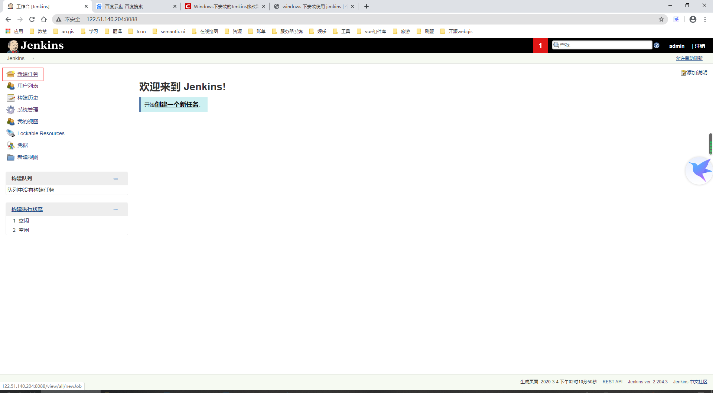
</div>

<div align=center>
	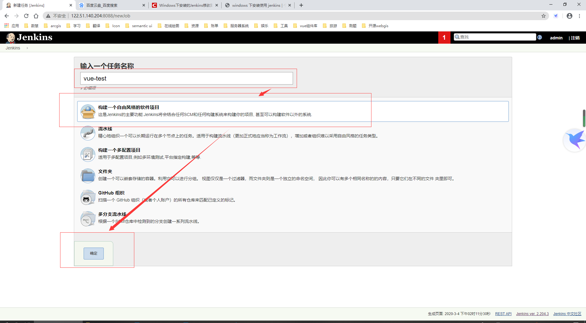
</div>

完成后就自动跳到配置界面,在源码管理选项中选择 Git，将项目的 git 地址粘贴到相应位置，这个时候由于没有配置凭证，jenkins 会报一个警告。点击添加凭证。

<div align=center>
	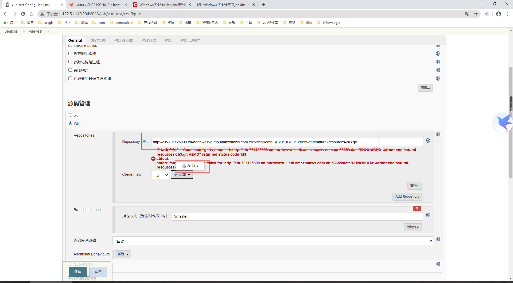
</div>

输入你的 gitlab 账户和密码到相应位置。

<div align=center>
	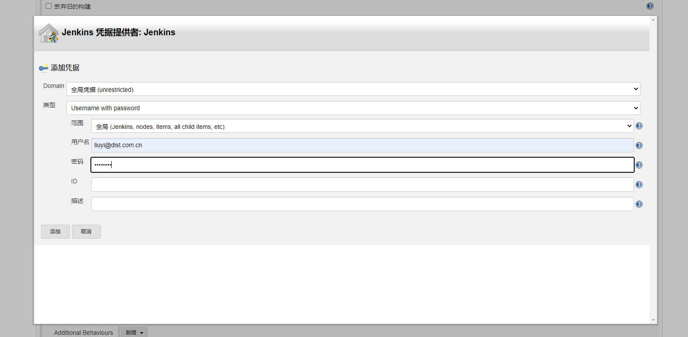
</div>

选择你刚才配置的全局凭证，修改打包时所用的分支名，保存任务，jenkins 的 git 配置就已完成。

<div align=center>
	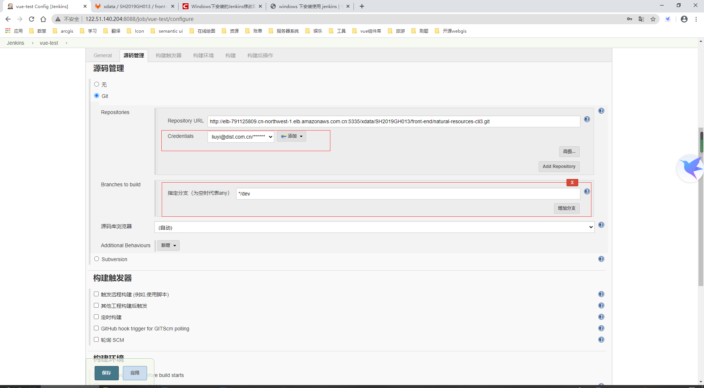
</div>

## jenkins 配置 node 环境

回到主页，依次选择系统管理=>插件管理=>可选插件，搜索 nodejs

<div align=center>
	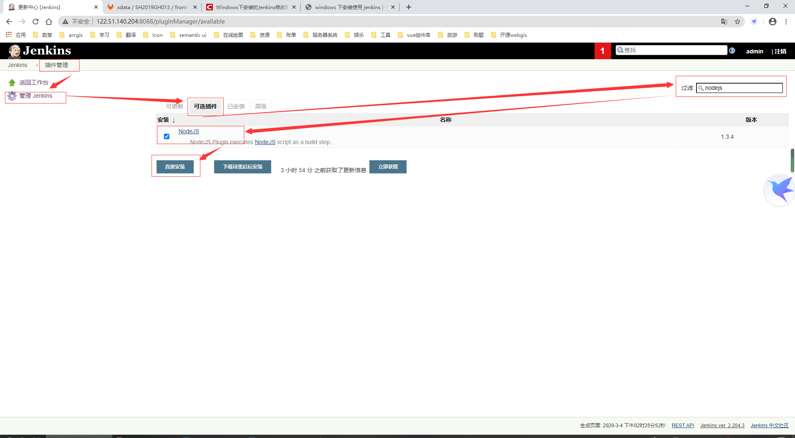
</div>

如果插件安装失败可以参照我上一篇博客。安装完成后依次选择：系统管理=>全局工具配置，找到 nodejs 选项，新增 node 环境，勾选自动安装，选择合适的 nodejs 版本，点击保存

<div align=center>
	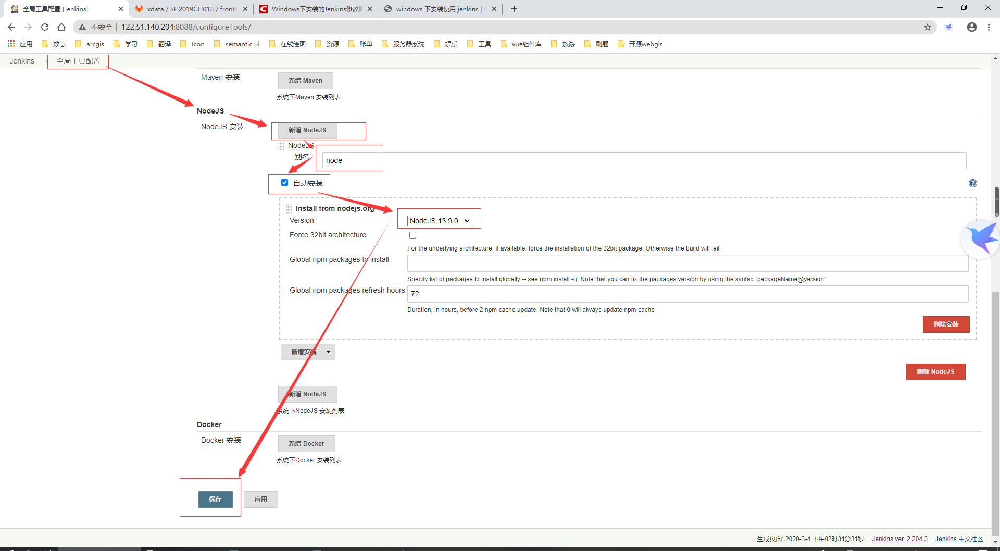
</div>

回到主页，找到刚才创建的任务，点击配置

<div align=center>
	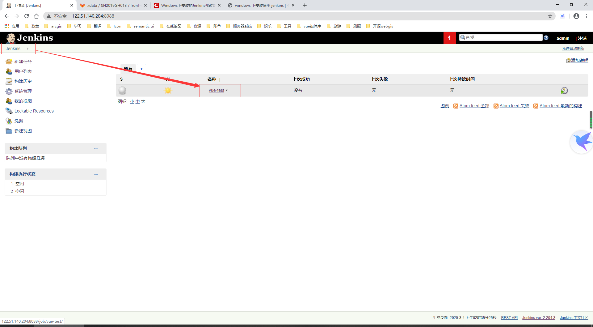
</div>

<div align=center>
	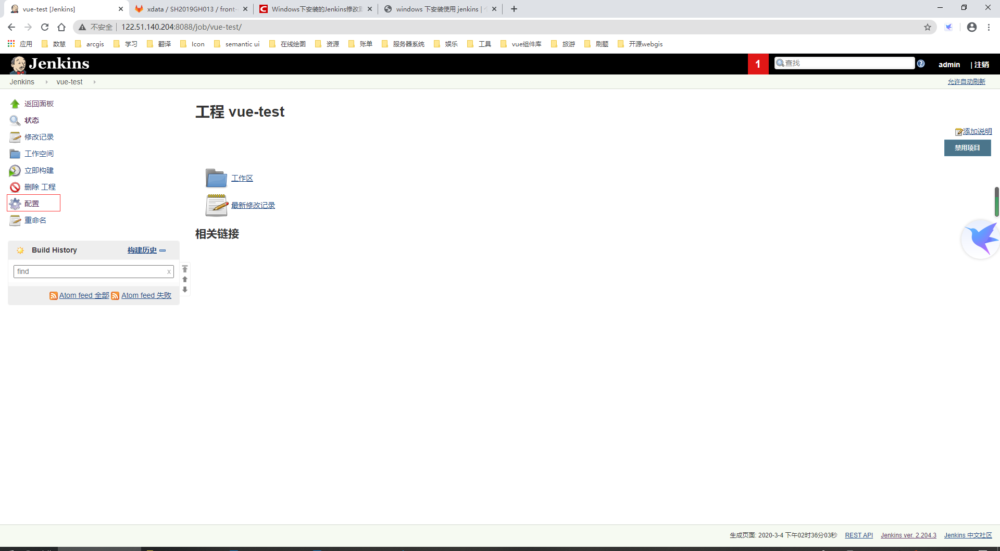
</div>

找到构建环境配置项，勾选如下图选择就可以调用刚刚配置的 node 环境了

<div align=center>
	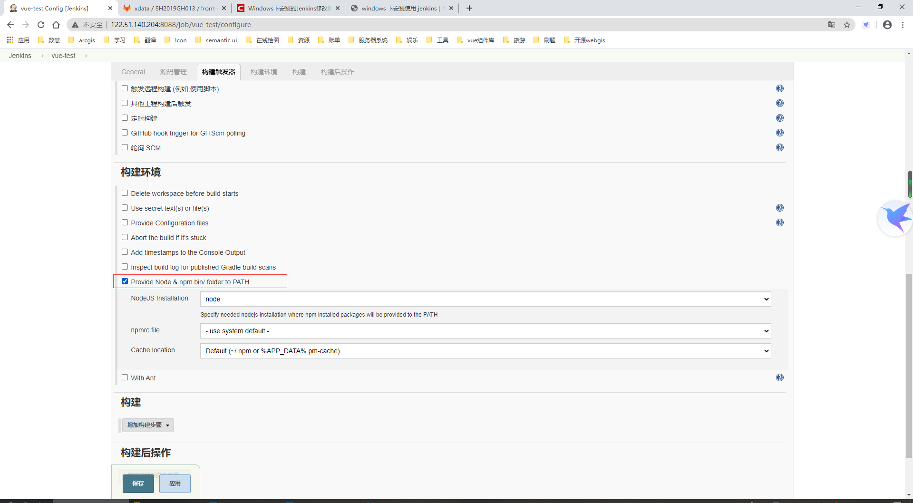
</div>

## jenkins 添加 powershell 命令

使用 powershell 是因为如果是用 commond 命令的话只会执行第一行命令，之后的命令不会执行。目前还在找原因。

回到主页，依次选择系统管理=>插件管理=>可选插件，搜索 powershell。

<div align=center>
	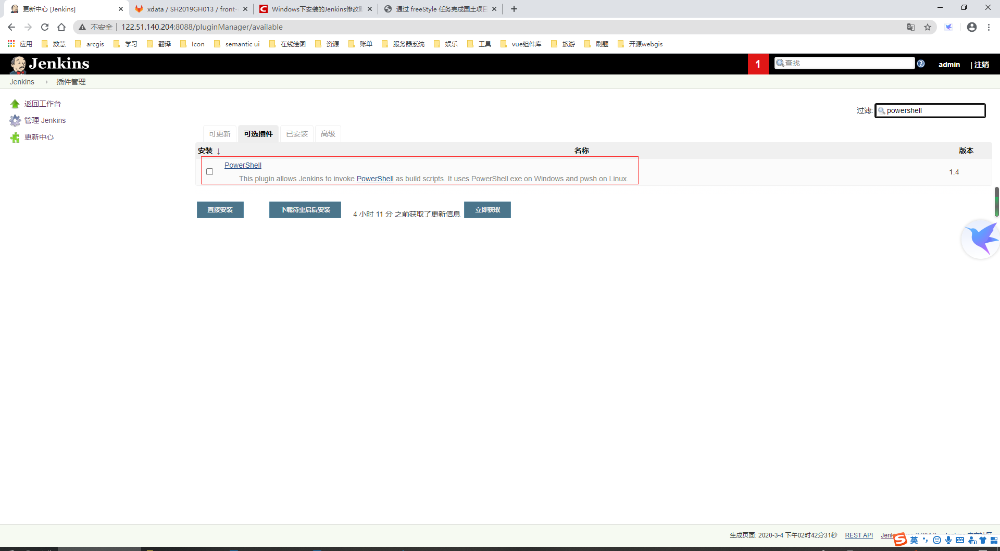
</div>

安装成功后，进入任务配置中，选择构建选项时就会多一个 powershell 的选项

<div align=center>
	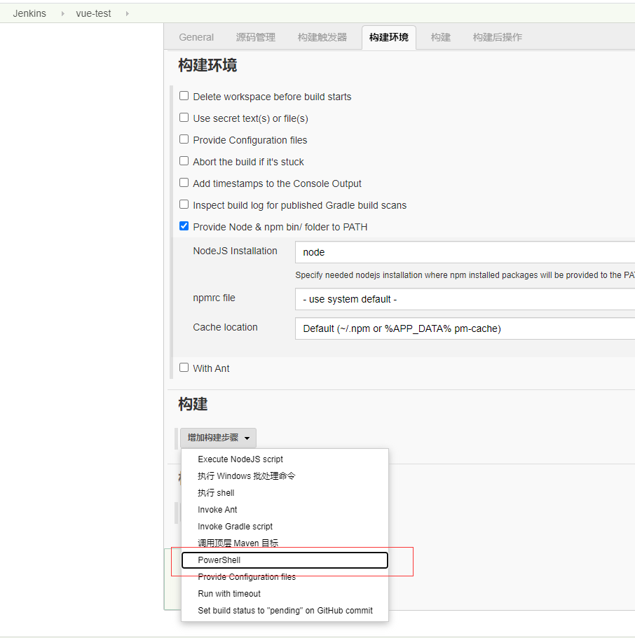
</div>

在命令行中输入如下命令

```
npm install -g yarn -registry=https://registry.npm.taobao.org
yarn install
yarn build
del .\dist\static\*.*
Compress-Archive -Path dist -DestinationPath dist.zip -Force
```

<div align=center>
	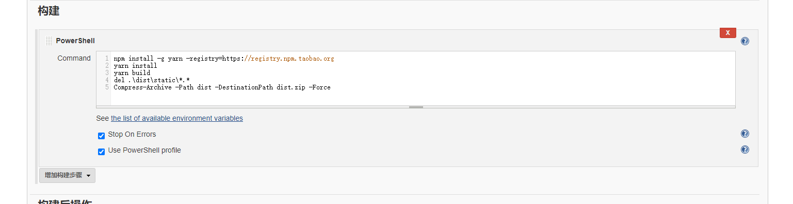
</div>

至此，该任务就已完成从 git 上拉最新的代码，将代码进行打包并将打包好的文件进行压缩等操作。

## 远程服务器的部署

项目完成了打包，接下来就需要将打包好的文件部署到远程服务器上。自由风格的任务需要依赖一个插件完成将文件传输到远程服务器的任务。

回到主页，依次选择系统管理=>插件管理=>可选插件，搜索 ssh

<div align=center>
	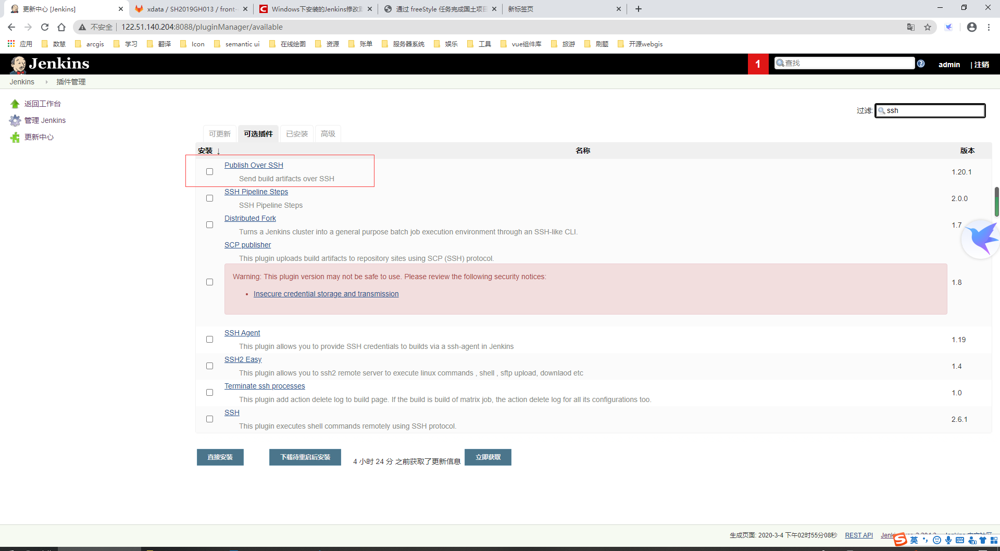
</div>

安装完成后，回到主页，依次选择：系统管理=>系统配置，找到 publish by ssh,点击新增

<div align=center>
	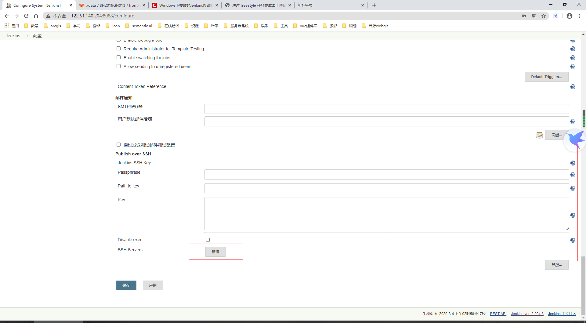
</div>

- windows 服务器需要安装 openssh，否则无法连接,下载地址`https://openssh.en.softonic.com/`

安装好 openssh 后，配置服务器连接信息，如下图所示

<div align=center>
	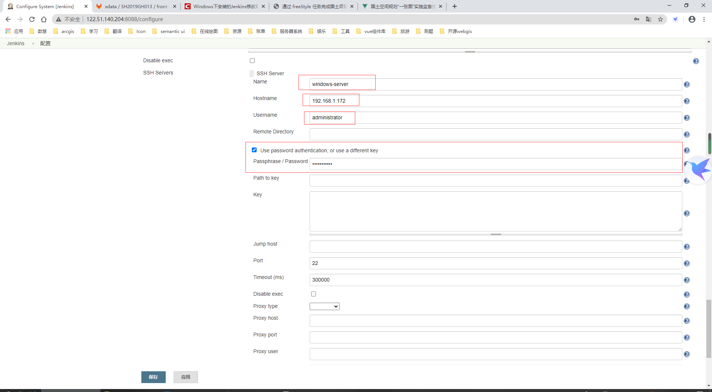
</div>

保存后回到任务配置，在构建步骤中添加 publish ssh 任务。

<div align=center>
	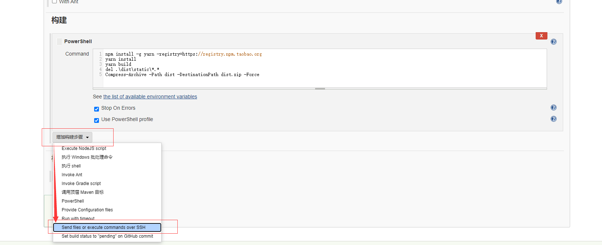
</div>

选择刚刚配置的服务器，指定刚刚压缩的压缩包，传送完成后执行服务端的一个脚本完成部署

## 远程服务器工作查看

登陆远程服务器进入该路径下`C:\Users\Administrator`jenkins 通过 ssh 插件发送过来的文件默认保存在该文件夹下。发送完成后执行的脚本也会放在这里

<div align=center>
	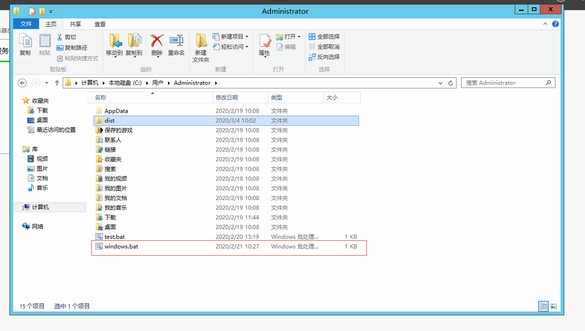
</div>

脚本代码如下，下面的代码注释是我临时加上去的，需要用的话需要删除注释。

```
// 删除之前的系统
del  E:\software\tomcat\webapps\dist\*.* /s /q
// 把压缩包移动到tomcat webapps文件夹下
move C:\Users\Administrator\dist.zip E:\software\tomcat\webapps

// 进入tomcat所在的硬盘
e:
// 进入tomcat文件夹
cd E:\software\tomcat\webapps
// 解压文件
7z x dist.zip
// 删除压缩包中的配置文件
del .\dist\static\*.* /s /q
// 将备份的配置文件拷贝进去
xcopy .\static\*.* .\dist\static\ /s/y
```

至此通过 freeStyle 自动化部署前端项目的步骤就已经完成。

## gitlab push 后触发 jenkins 完成部署

<div align=center>
	
</div>

实现流程：每次开发人员执行 push 命令到 gitlab，gitlab 如果设置了 webhook 监听了 push 命令便会触发相应的事件，调用 jenkins 相应任务完成系统部署。

也就是说 gitlab 服务器，jenkins 所在的服务器以及系统服务器的网络是互通的，但由于目前绝大多数系统由于安全的原因，系统服务器的网络外网无法访问。为了能使用 jenkins 所以 jenkins 服务器应该和系统服务器都部署在内网中。也就导致了 gitlab 服务器无法给 gitlab 服务器发送请求，实现 push 后自动部署。

回到主页，依次选择系统管理=>插件管理=>可选插件，搜索 gitlab 安装如下插件

<div align=center>
	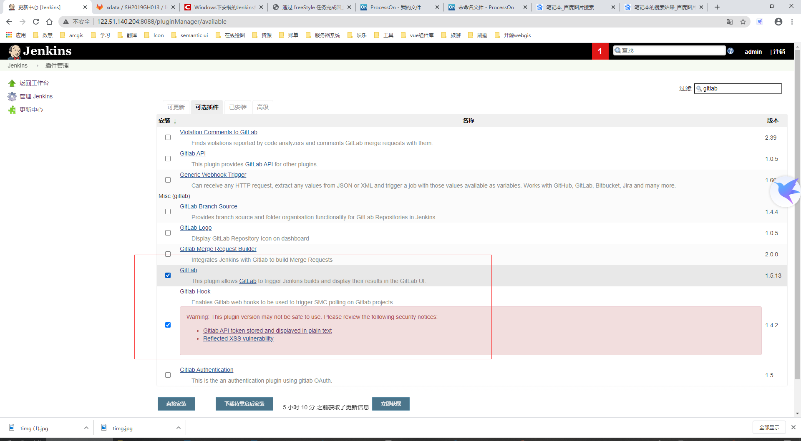
</div>

安装完成后，进入任务的配置界面找到构建触发器，点击高级。

<div align=center>
	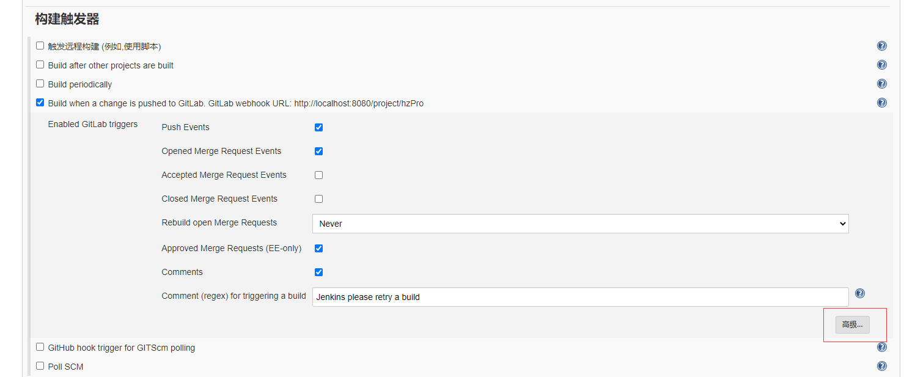
</div>

点击 generate 生成任务的 taken

<div align=center>
	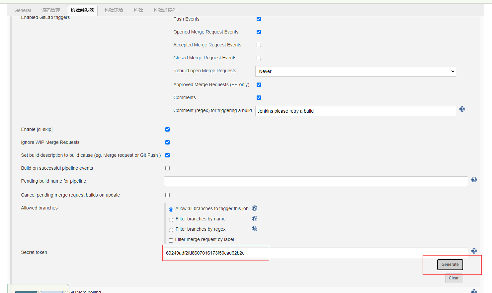
</div>

登陆 gitlab 找到项目进入 Setting=>integrations,将 jenkins 构建器中的地址和生成的 token 配置到相应位置。

<div align=center>
	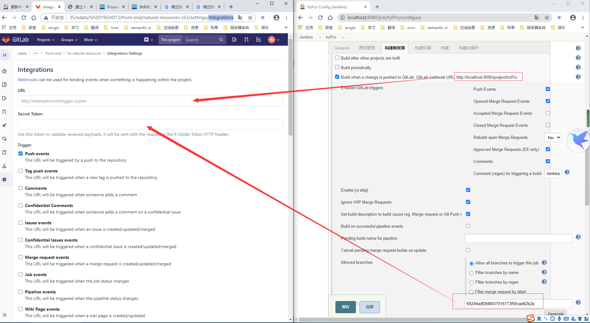
</div>

保存后即可看到你刚刚构建的 webhook

<div align=center>
	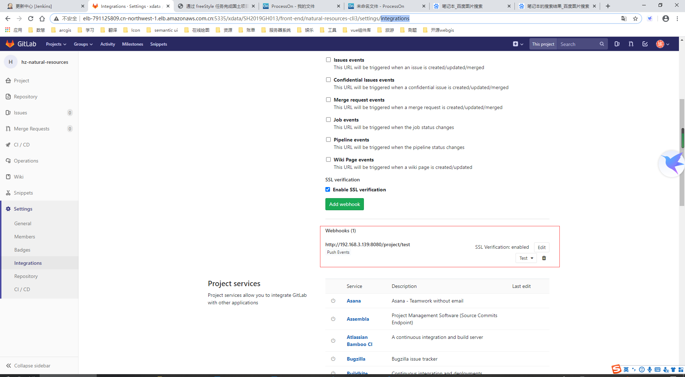
</div>

修改代码后，push 后即可在 gitlab 上即可看到调用 jenkins 的任务

<div align=center>
	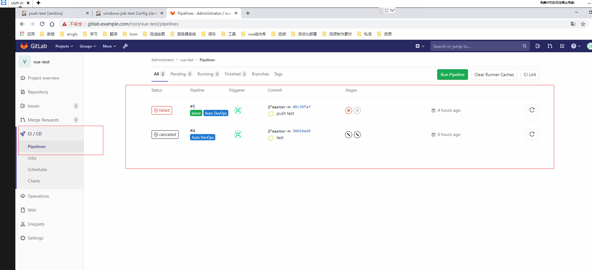
</div>

jenkins 也可以看到触发的任务

<div align=center>
	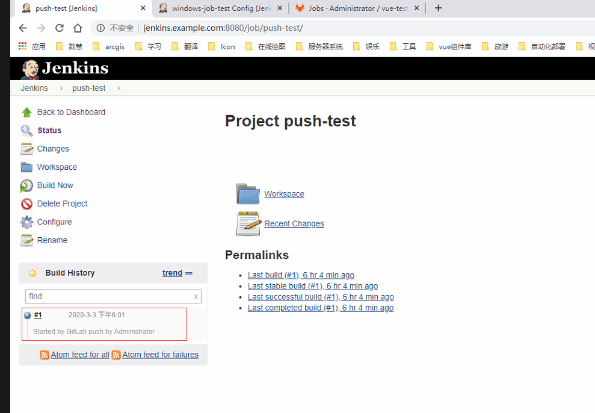
</div>

不清楚是不是 gitlab 只支持 pipline 任务的回调，自由风格的系统 jenkins 已经显示成功了但是 gitlab 看不到成功的消息。

总结：自由风格的任务构建简单，测试容易，不需要额外花时间去学习其他脚本语言，凭借 jenkins 强大的插件库已经能完成绝大多数前端的构建任务。但网上说 jenkins 插件安全性不够，如果 jenkins 服务器外网能访问的话，其他人很容易通过插件的漏洞做一些危害系统服务器的事。不过目前系统服务器大多是都是内网环境，还是可以先在自己电脑上安装 jenkins 手动执行系统的打包发布。这些工作也能为前端开发节省不少时间。
