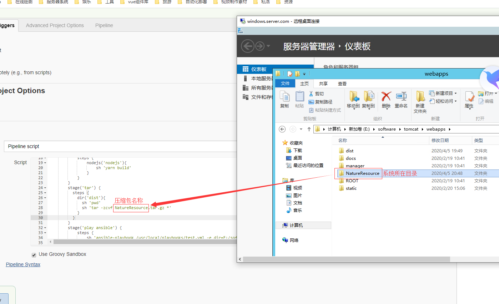

# pipline+ansible 实现前端自动化部署

## pipline 脚本参考

### 完整代码如下

```
pipeline {
    stages {
        stage('pullcode'){
            steps{
                git branch: 'dev', credentialsId: '70a54454-c8a3-43c1-ada0-91d4a79dd1a4', url: 'http://elb-791125809.cn-northwest-1.elb.amazonaws.com.cn:5335/xdata/SH2019GH080/front-end/ZheJNaturalResources.git'
            }
        }

        stage('install') {
            steps {
                sh 'yarn install'
            }
        }
          stage('build'){
            steps {
                sh 'yarn build'
            }
        }
        stage('tar') {
          steps {
            dir('dist'){
              sh 'pwd'
              sh 'tar -zcvf NatureResource.tar.gz *'
            }
          }
        }

        stage('play ansible') {
            steps {
                sh 'ansible-playbook /usr/local/playbooks/test.yml -e dir=E:/software/tomcat/webapps/ -e dir2=NatureResource -e dir3=/var/lib/jenkins/workspace/ansible-test/dist/'
            }
        }
    }
}
```

### 获取最新分支代码

```
stage('pullcode'){
    steps{
        git branch: 'dev', credentialsId: '70a54454-c8a3-43c1-ada0-91d4a79dd1a4', url: 'http://elb-791125809.cn-northwest-1.elb.amazonaws.com.cn:5335/xdata/SH2019GH080/front-end/ZheJNaturalResources.git'
    }
}
```

`git branch`:获取指定分支的代码。

`credentialsId`: jenkins 配置 gitlab 用户的全局凭证 id。

`git`: git 仓库地址。

::: warning 注意
jenkins 所在服务器必须全局安装了 ansible，nodejs 等环境以及将 yarn，ansible-playbook 命令配置到全局
:::

### 前端项目的打包

```
stage('install') {
    steps {
        sh 'yarn install'
    }
}
stage('build'){
    steps {
        sh 'yarn build'
    }
}
```

### 将打包好的系统进行压缩

```
stage('tar') {
    steps {
        dir('dist'){
            sh 'pwd'
            sh 'tar -zcvf NatureResource.tar.gz *'
        }
    }
}
```

### 将系统通过 ansible 发布到远程服务器上

```
stage('play ansible') {
    steps {
        sh 'ansible-playbook /usr/local/playbooks/test.yml -e dir=E:/software/tomcat/webapps/ -e dir2=NatureResource -e dir3=/var/lib/jenkins/workspace/ansible-test/dist/'
    }
}
```

`ansible-playbook /usr/local/playbooks/test.yml`: ansible-playbook 执行预先编写好的 yml 脚本。

- 以下均为给执行的 ansible 脚本传的参数-e 命令代表后面接的是参数

`-e dir=E:/software/tomcat/webapps/`: 远程服务器 tomcat 所在目录

`-e dir2=NatureResource`: 前端系统所在文件夹
::: warning 注意
为了避免重复编写脚本，目前我默认将远程服务器系统根目录的文件名和压缩包名进行统一。

<div align=center>
	
</div>
:::

`-e dir3=/var/lib/jenkins/workspace/ansible-test/dist/`: 压缩包所在路径

## ansible 脚本参考

### 环境准备

- 配置远程服务器 host 信息

确保 ansible hosts 文件中有需要部署的远程服务器的配置信息

hosts 文件路径:/usr/ansible/hosts

示例配置：

```
[wind]
192.168.247.151 ansible_ssh_user="Administrator" ansible_ssh_pass="NPS#2018" ansible_ssh_port=5985 ansible_connection="winrm" ansible_winrm_server_cert_validation=ignore

```

### 全部脚本参考

::: warning 警告
以下#后面的注释是我为了方便，之后加上去的，playbook 语法并不认识，使用的时候需要去除
:::

```
# 需要部署的远程服务器名称
- hosts: wind3
  # 以哪个用户操作远程服务器
  remote_user: administrator
  # 执行的操作
  tasks:
    # 将压缩好的压缩包发送到远程服务器指定目录
    - name: send file
      win_copy: src={{dir3}}{{dir2}}.tar.gz dest={{dir}}
    # 删除老项目
    - name: delete old file
      win_file: path={{dir}}{{dir2}} state=absent
    # 新建项目所在文件夹
    - name: make new dir
      win_file: path={{dir}}{{dir2}} state=directory
    # 将压缩包移动至新建文件夹下
    - name: move file
      win_shell: move {{dir}}{{dir2}}.tar.gz {{dir}}{{dir2}}/
    # 解压压缩包
    - name: tar .tar.gz
      win_shell: 7z x {{dir}}{{dir2}}/{{dir2}}.tar.gz -o{{dir}}{{dir2}}/
    # 解压压缩包
    - name: tar .tar
      win_shell: 7z x {{dir}}{{dir2}}/{{dir2}}.tar -o{{dir}}{{dir2}}/
    # 删除老的配置文件
    - name: delete old file
      win_file: path={{dir}}{{dir2}}/static state=absent
    # 拷贝服务器备份的配置文件
    - name: copy config
      win_copy: src={{dir}}static dest={{dir}}{{dir2}}/ remote_src=true
```

::: tip 总结

通过 pipline+ansible 方式实现前端的自动化部署，舍弃了 freestyle 任务编写脚本的麻烦，其他项目只需修改 pipline 中一些简单的参数即可，很容易易于移植到其他项目中。
:::
