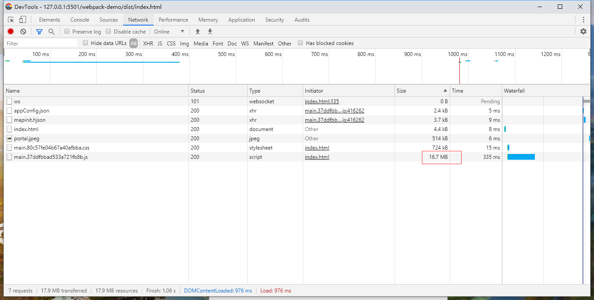

# splitChunks 代码分离

上一章我们通过自己写的配置文件成功打包了国土项目，但是当在浏览器中浏览打包好的系统时发现首页加载的特别慢，清空缓冲后打开开发者工具。

<div align=center>
	
</div>

可以看到有一个 js 体积达到了 15m。这还是在以小的打包效果下进行代码压缩后的结果。线上环境在加载页面前去加载这么大的文件肯定会导致首页卡顿的现象。这个时候就需要了解一下 webpack 内置的代码分离的插件[SplitChunksPlugin](https://webpack.docschina.org/plugins/split-chunks-plugin/)。

这个插件无需另外安装使用，webpack 默认已经将其集成，只需要修改相应配置即可，默认配置如下：

```js {4-24}
module.exports = {
  //...
  optimization: {
    splitChunks: {
      chunks: "async",
      minSize: 30000,
      maxSize: 0,
      minChunks: 1,
      maxAsyncRequests: 5,
      maxInitialRequests: 3,
      automaticNameDelimiter: "~",
      name: true,
      cacheGroups: {
        vendors: {
          test: /[\\/]node_modules[\\/]/,
          priority: -10,
        },
        default: {
          minChunks: 2,
          priority: -20,
          reuseExistingChunk: true,
        },
      },
    },
  },
};
```

默认 webpack 会将引入的模块都打包到一个 js 文件中，maxSize 这个配置的意思就是如果这个配置不为 0，当打包引入模块 js 文件大小超过这个值的时候，webpack 会将不同模块单独打包到另一个 js 文件中。修改后的配置如下

```
optimization: {
  splitChunks: {
    chunks: "async",
    minSize: 30000,
    maxSize: 100000,
    minChunks: 1,
    maxAsyncRequests: 5,
    maxInitialRequests: 3,
    automaticNameDelimiter: "~",
    name: true,
    cacheGroups: {
      vendors: {
        test: /[\\/]node_modules[\\/]/,
        priority: -10,
        name: 'vendors',
        chunks: "all"
      },
      default: {
        minChunks: 2,
        priority: -20,
        reuseExistingChunk: true
      }
    }
  }
}
```
