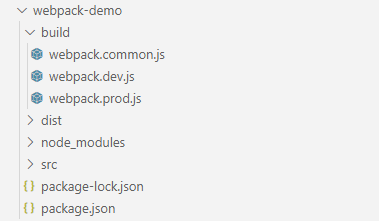

# 线上环境和开发环境

我们在开发的时候肯定遇到过环境问题，例如:package.json 中的 devDependencies 与 dependencies，webpack 配置中的 development 与 production。他们之间各自是什么意思，又有什么区别。

## dependencies 与 devDependencies

在通过 npm 安装我们所需要的的依赖时，多少要思考一下，这个是依赖要放在哪？首先我们来看一下这两个模块是什么意思？

`dependencies`:线上环境，指网页完成开发后用户使用的系统所在环境。

`devDependencies`:开发环境，指开发人员在进行开发调试时所使用的环境。

如何区分这两个环境？webpack 打包后只会包含 dependencies 下库的代码，如果开发人员把线上会用到的库例如 jquery 安装到了 devDependencies 下则打包完成后，线上的代码将不会包含 jquery，代码中关于 jquery 的用法也会因为没有 jquer 代码而报错。

如果开发人员把只有在开发时用到的插件例如 webpack 安装到了线上环境，虽然不会影响线上环境的系统运行，但由于打包过程中多了线上环境不需要的库会降低打包效率影响开发效率。

## development 和 production

这个是 webpack 配置中对线上环境和开发环境的区分。

`production`:线上环境，指网页完成开发后用户使用的系统所在环境。

`development`:开发环境，指开发人员在进行开发调试时所使用的环境。

无论是线上环境还是开发环境都需要依赖 webpack 将项目打包成能在浏览器上执行的文件，但由于开发人员和用户使用目的不同，就需要对这两种用户的需求书写相应的 webpack 配置。例如开发人员需要实时查看修改后的效果，就需要在配置中加上热模块更新的相应配置。

因此需要对 webpack 的配置进行分割，在项目中新建 build 目录用于存放 webpack 配置。新建 webpack.common.js 用户配置通用配置，webpack.prod.js 用于配置线上环境的特有配置，webpack.dev.js 用于配置开发环境特有配置。调整后目录结构如下。

<div align=center>
	
</div>

执行命令`npm i webpack-merge --save-dev`安装 webpack 配置合并插件

webpack.common.js 初始代码如下

```
const path = require("path");

module.exports = {
  entry: {
    main: "./src/main.js"
  },
  output: {
    filename: "[name].[chunkhash].js",
    path: path.resolve(__dirname, "../dist")
  }
};
```

webpack.prod.js 初始代码如下

```
const merge = require("webpack-merge");
const common = require("./webpack.common.js");

module.exports = merge(common, {
  mode: "production"

});
```

开发环境执行`npm i webpack-dev-server --save-dev`使用 webpack-dev-server 插件实现实时预览更新，webpack.dev.js 初始代码如下

```
const merge = require("webpack-merge");
const common = require("./webpack.common.js");

module.exports = merge(common, {
  mode: "development",
  devServer: {
    contentBase: "../dist",
    port: 8088,
    open: true
  }
});
```

在 package.json 中修改命令如下

<div align=center>
	
</div>

```
"dev": "webpack-dev-server --config ./build/webpack.dev.js",
"build": "webpack --config ./build/webpack.prod.js"
```
