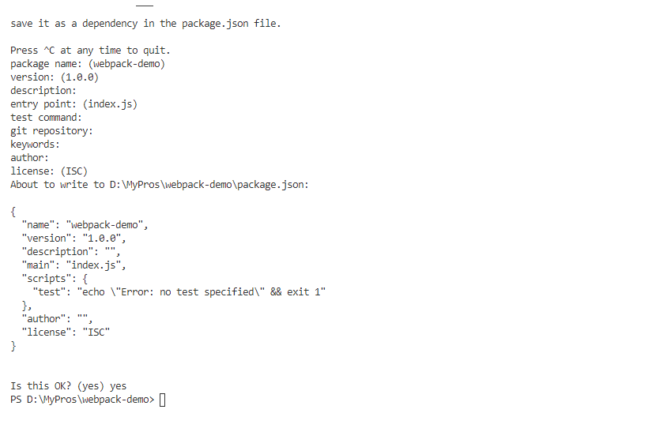
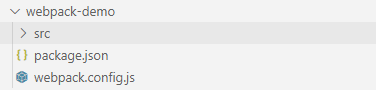
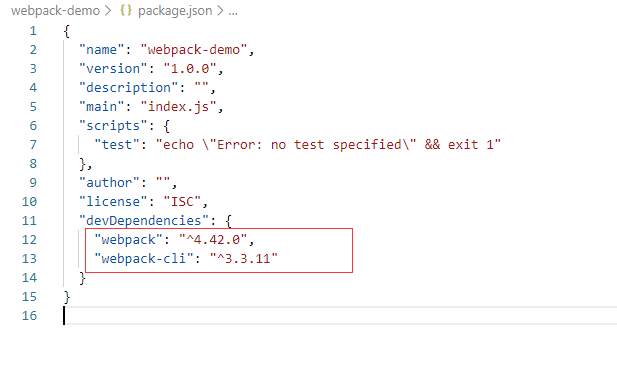
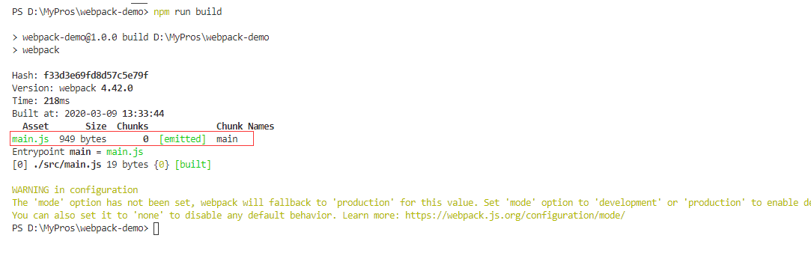
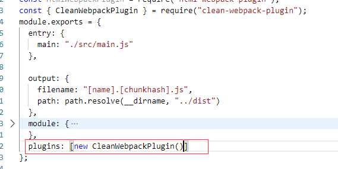

# 从零构建 webpack 工程

## 用 npm 管理项目

npm 是世界上最大 JavaScript 的软件注册表，每星期大约有 30 亿次的下载量，包含超过 600000 个 包（package） （即，代码模块）。来自各大洲的开源软件开发者使用 npm 互相分享和借鉴。包的结构使您能够轻松跟踪依赖项和版本。[官网介绍](https://www.npmjs.cn/getting-started/what-is-npm/)

新建项目文件夹 webpack-demo,进入该文件夹下通过命令`npm init`一路回车,让该项目使用 npm

<div align=center>
	
</div>

完成可以看到 npm 在文件夹下生成了一个 package.json 的配置文件

```
{
	//项目名称
  "name": "webpack-demo",
  // 项目当前版本
  "version": "1.0.0",
  // 项目描述
  "description": "",
  // 项目入口文件
  "main": "index.js",
  // 项目可运行的命令
  "scripts": {
    "test": "echo \"Error: no test specified\" && exit 1"
  },
  // 作者名称
  "author": "",
  // 许可类型
  "license": "ISC"
}

```

## 项目初始化

新建 src 文件夹用于存放项目业务逻辑代码并新建入口文件 main.js，新建 webpack.config.js 打包配置文件，完成后项目目录结构如下图所示：

<div align=center>
	
</div>

执行`npm install webpack webpack-cli --save-dev`安装 webpack 基础包。

<div align=center>
	
</div>

在 webpack.config.js 中写入基础配置

```
const path = require('path');

module.exports = {
  entry: './src/main.js',
  output: {
    filename: 'main.js',
    path: path.resolve(__dirname, 'dist')
  }
};
```

在 package.json 的 script 中添加一行命令：`"build": "webpack"`,然后在项目根路径下执行命令：`npm run build`即可看到 webpack 正确执行并打包出来的信息。

<div align=center>
	
</div>

每次打包都要手动删除上次打包的文件，这样太过浪费时间，可以使用一个插件帮我们做这件事

执行`npm i clean-webpack-plugin --save-dev`安装清除插件，在配置中 plugin 配置中使用这个插件,

<div align=center>
	
</div>

::: warning 注意
`clean-webpack-plugin`最新版这个插件使用方法变了，引入要通过

`const { CleanWebpackPlugin } = require("clean-webpack-plugin");`

这种方式引入，以及无需传递任何参数。
:::

[官网参考资料](https://webpack.docschina.org/guides/getting-started/)
