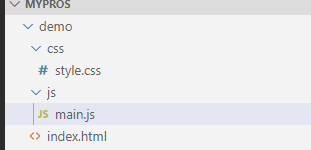

# webpack简介
## 为什么要用webpack？
回答这个问题之前，大家可以回想一下自己最开始接触前端时，是如何搭建前端项目的？我相信绝大多数人的前端项目跟下图类似。一个html页面，在页面中引入所需要的的样式和js资源。

随着前端技术的飞速发展，js有了es5,es6,es7等诸多新标准,css也有了less，sass等更简洁的语法标准。运用这些新特性使前端代码更容易书写和阅读，同时随着nodejs的诞生，react，vue等优秀的前端框架也大大加快了前端的开发速度。但是一些老版本的浏览器对这些新技术的支持却没有那么好，甚至根本不认识.vue、.jsx等文件。这就导致了一个问题要怎样才能让前端开发即能使用最新的前端技术，又能让通过这些最新技术开发的项目在绝大多数浏览器上运行呢？

这就需要通过某个工具将开发人员使用新技术写的代码，翻译成市场上绝大多数浏览器都认识的代码，并对翻译后的代码进行压缩，分块，优化等操作，而webpack就是这些工具中功能最强且使用最广泛的那个。