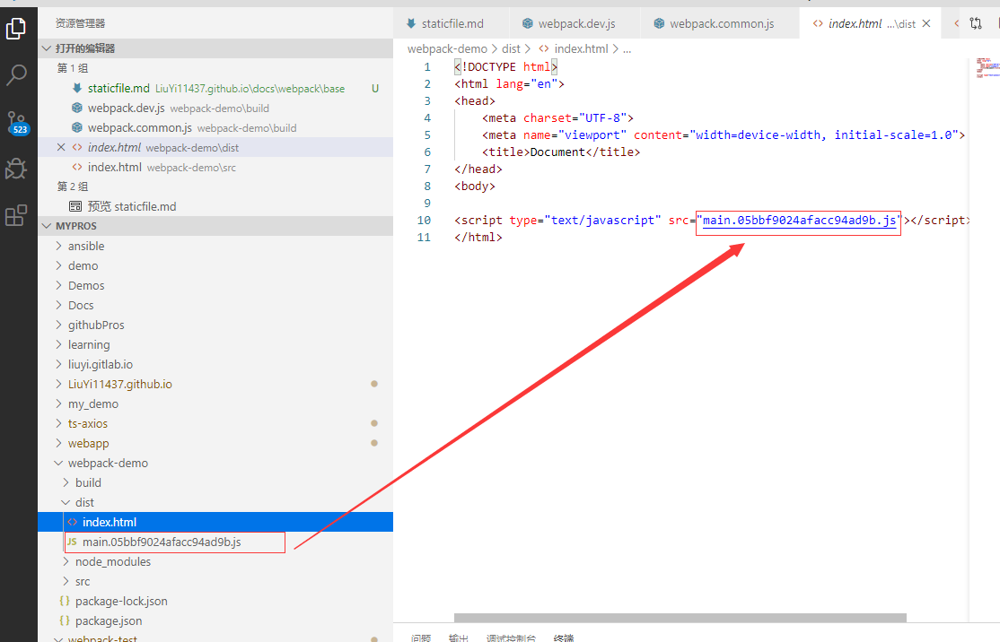
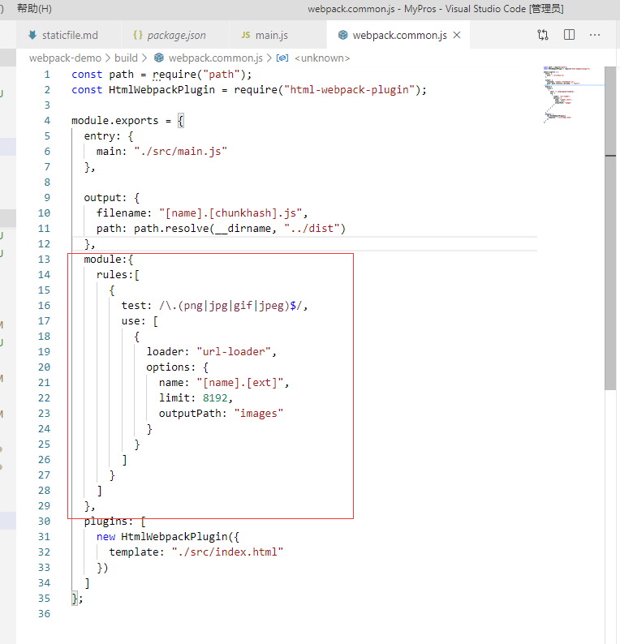
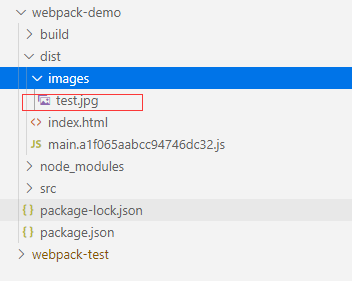
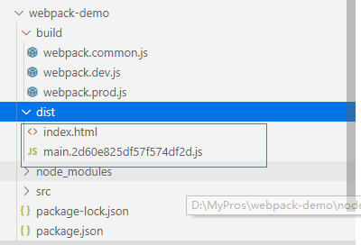
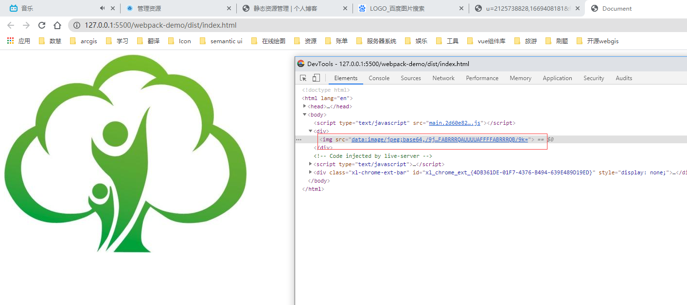

# 简单静态资源管理

## 使用 html 模板

很多时候我们既需要 html 页面引入 webpack 最新生成的 js，css 等资源，有希望能够对主页面进行一些定制化的修改，例如：修改 titile，添加一些全局的样式，引入自定义的插件等。这个时候就需要用到一个插件 HtmlWebpackPlugin

首先通过命令`npm i html-webpack-plugin --save-dev`安装该插件。

在 src 目录下新建 html 模板

然后修改 webpack 通用配置 webpack.common.js 如下:

```
const path = require("path");
const HtmlWebpackPlugin = require("html-webpack-plugin");

module.exports = {
  entry: {
    main: "./src/main.js"
  },
  output: {
    filename: "[name].[chunkhash].js",
    path: path.resolve(__dirname, "../dist")
  },
  plugins: [
    new HtmlWebpackPlugin({
      template: "./src/index.html"
    })
  ]
};

```

执行命令`npm run build`查看打包效果

<div align=center>
	
</div>

可以看到，生成的 js 文件自动引入到 html 页面中

<div align=center>
	
</div>

[官网参考](https://webpack.docschina.org/plugins/html-webpack-plugin/)

## 图片处理

webpack 默认只支持对 js 代码进行打包，其他文件必须配置对应的 loaders，否则会报错。

通过命令`npm i url-loader file-loader --save-dev`安装处理的图片的 loader

修改 webpack 配置，添加处理图片的规则如下

<div align=center>
	
</div>

示例代码：

```
  module:{
    rules:[
      {
        test: /\.(png|jpg|gif|jpeg)$/,
        use: [
          {
            loader: "url-loader",
            options: {
              name: "[name].[ext]",
              limit: 8192,
              outputPath: "images"
            }
          }
        ]
      }
    ]
  }
```

配置说明：

`name`: 导出图片的命名规则，一般不会修改也不会加哈希值，如果加了哈希值每次部署上线，用户都要重新加载图片，影像效率。

`limit`: 超过这个配置的图片文件会打包成图片文件，低于怎会打包成 base64 的字符串放在 js 文件中。

`outputPath`: 把图片打包到指定文件夹中

在入口文件中写测试代码如下

```
 import Icon from './images/test.jpg';

  function component() {
    var element = document.createElement('div');

   // 将图像添加到我们已经存在的 div 中。
   var myIcon = new Image();
   myIcon.src = Icon;

   element.appendChild(myIcon);

    return element;
  }

  document.body.appendChild(component());
```

打包命令后，打包文件结构如下

<div align=center>
	
</div>

将 limit 值大于图片时，再次打包即可发现没有了 test.jpg 文件

<div align=center>
	
</div>

打开 index.html 就会发现图片打包成了 base64 代码

<div align=center>
	
</div>

## 字体文件处理

添加处理字体文件的 rule

```
{
    test: /\.(woff|woff2|eot|ttf|otf)$/,
    use: [
          {
            loader: "file-loader",
            options: {
              name: "[name].[ext]",
              outputPath: "font"
            }
        }
    ]
}
```

## svg 处理

添加处理 svg 文件的 rule

```
      {
        test: /\.svg$/,
        use: [
          {
            loader: "file-loader",
            options: {
              name: "[name].[ext]",
              outputPath: "svg"
            }
          }
        ]
      }
```

[官网资料 url-loader](https://webpack.docschina.org/loaders/url-loader/)

[官网资料 file-loader](https://webpack.docschina.org/loaders/file-loader/)

::: tip 提示
url-loader 和 file-loader 之间的关系，url-loader 依赖 file-loader,所以在使用 url-loader 的时候同时也要安装 file-loader。url-loader 有 limit 属性在图片的处理上比 file-loader 更灵活。
:::
