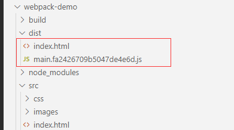
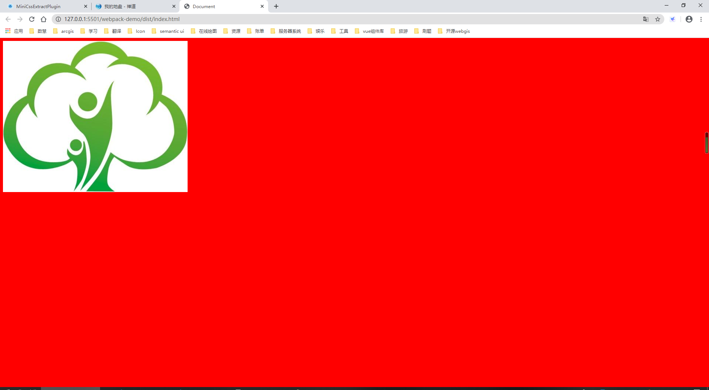
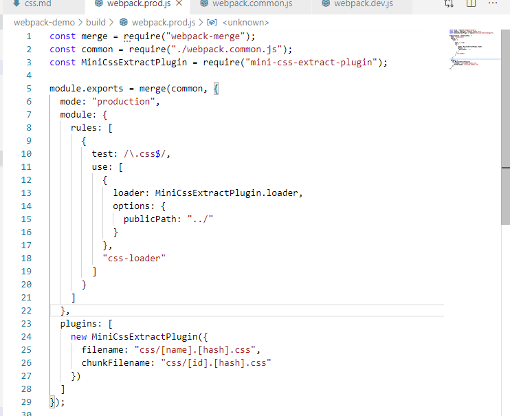
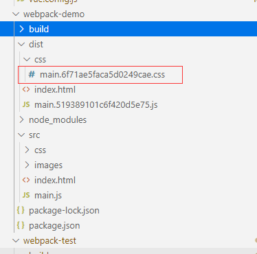
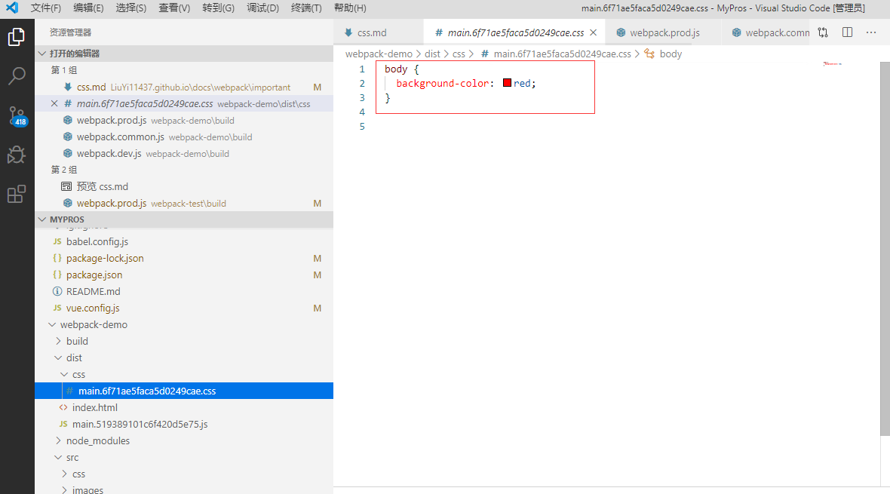
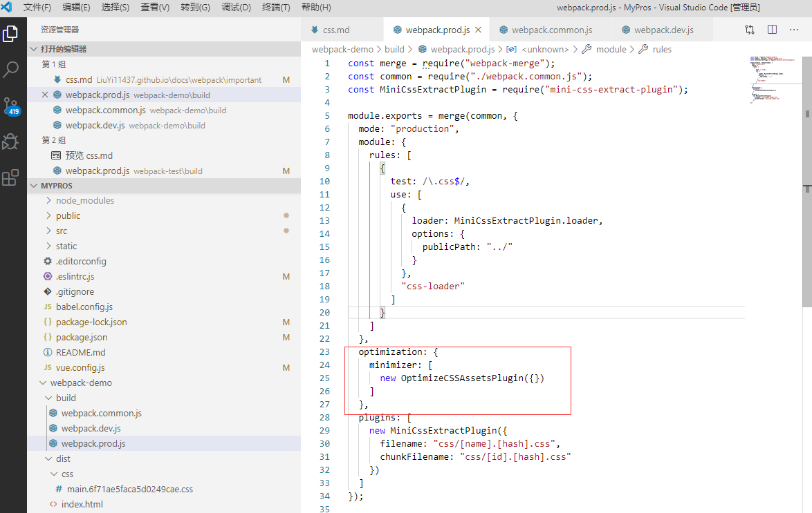
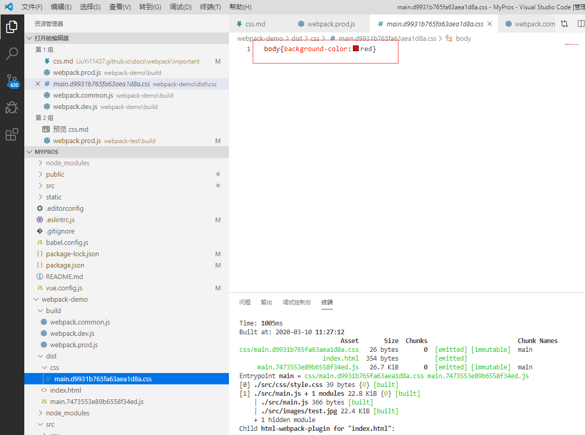

# 样式文件处理

## .css 文件处理

执行如下命令安装处理 css 文件的插件

```
npm install --save-dev style-loader css-loader
```

在配置中添加处理 css 文件的 rule 如下

```
{
    test: /\.css$/,
    use: ["style-loader", "css-loader"]
}
```

新建一个 css 文件给 body 添加背景颜色，在入口文件中引入，然后执行打包。结果如下图所示：

<div align=center>
	
</div>

<div align=center>
	
</div>

::: tip 提示
可以看到打包出来的文件里并没有相应的 css，但是页面中却有了对应的样式。这是因为 style-loader 会将引入的 css 文件打包到 js 文件中，并注入到页面的 style 标签中。在开发环境下因为所有的文件都是打包在内存中，可以实现热模块更新实时查看修改的效果。但是线上环境如果引入的样式都打包到 js 文件中则会导致打包的 js 文件过大导致用户访问速度变慢，影响体验。所以在线上环境中需要将 css 打包成单个文件。
:::

[css-loader 官网参考](https://webpack.docschina.org/loaders/css-loader/) [style-loader 官网参考](https://webpack.docschina.org/loaders/style-loader/)

## 线上 css 打包

执行命令`npm install --save-dev mini-css-extract-plugin`安装 MiniCssExtractPlugin 插件将 css 打包成单个文件。

在 webpack.prod.js 中添加处理 css 文件的 rule 如下。

```
{
    test: /\.css$/,
    use: [
        {
        loader: MiniCssExtractPlugin.loader,
        options: {
            publicPath: "../"
        }
        },
        "css-loader"
    ]
}
```

在插件配置中使用 MiniCssExtractPlugin 插件，前面的`css/`表示将生成的 css 文件打包到 css 文件夹中

```
new MiniCssExtractPlugin({
    filename: "css/[name].[hash].css",
    chunkFilename: "css/[id].[hash].css"
})
```

完整代码如下图所示：

<div align=center>
	
</div>

执行打包命令，可以看到打包出来的 css 文件。

<div align=center>
	
</div>

查看打包后的 css 文件内容时可以发现，css 文件中的内容没有被压缩，如果去掉空行和空格可以减小打包后的文件大小提升加载速度。

<div align=center>
	
</div>

这时候就要安装 OptimizeCSSAssetsPlugin 插件，对 css 代码进行压缩。

执行命令`npm i optimize-css-assets-webpack-plugin --save-dev`

在 webpack.prod.js 添加如下配置

```
  optimization: {
    minimizer: [
      new OptimizeCSSAssetsPlugin({})
    ]
  }
```

完整代码如下：

<div align=center>
	
</div>

执行打包，查看打包后的 css 文件

<div align=center>
	
</div>

## scss 文件处理

安装依赖

```
npm install sass-loader node-sass --save-dev
```

添加对 scss 文件的处理规则如下：

```
{
      test: /\.scss$/,
      use: [
        {
          loader: MiniCssExtractPlugin.loader,
          options: {
            publicPath: "../"
          }
        },
        "css-loader",
        {
          loader: "sass-loader",
          options: {
            prependData: `@import "@/styles/index.scss";`
          }
        }
    ]
}
```

sass 文件可以定义全局参数，可以在 sass-loader 中给 prependData 参数传入相应参数文件实现。

[官网参考资料](https://webpack.docschina.org/loaders/sass-loader/)

## less 文件处理

安装依赖

```
npm i less-loader --save-dev
```

添加对 less 文件的处理规则

```
{
      test: /\.less$/,
      use: [
        {
          loader: MiniCssExtractPlugin.loader,
          options: {
            publicPath: "../"
          }
        },
        "css-loader",
        "less-loader"
    ]
}
```

[官网参考资料](https://webpack.docschina.org/loaders/less-loader/#src/components/Sidebar/Sidebar.jsx)

至此常用的样式文件的处理已经完成，线上环境完整代码参考：

```
const merge = require("webpack-merge");
const common = require("./webpack.common.js");
const MiniCssExtractPlugin = require("mini-css-extract-plugin");
const OptimizeCSSAssetsPlugin = require("optimize-css-assets-webpack-plugin");

module.exports = merge(common, {
  mode: "production",
  module: {
    rules: [
      {
        test: /\.css$/,
        use: [
          {
            loader: MiniCssExtractPlugin.loader,
            options: {
              publicPath: "../"
            }
          },
          "css-loader"
        ]
      },
      {
        test: /\.scss$/,
        use: [
          {
            loader: MiniCssExtractPlugin.loader,
            options: {
              publicPath: "../"
            }
          },
          "css-loader",
          {
            loader: "sass-loader",
            options: {
              prependData: `@import "@/styles/index.scss";`
            }
          }
        ]
      },
      {
        test: /\.less$/,
        use: [
          {
            loader: MiniCssExtractPlugin.loader,
            options: {
              publicPath: "../"
            }
          },
          "css-loader",
          "less-loader"
        ]
      }
    ]
  },
  optimization: {
    minimizer: [
      new OptimizeCSSAssetsPlugin({})
    ]
  },
  plugins: [
    new MiniCssExtractPlugin({
      filename: "css/[name].[hash].css",
      chunkFilename: "css/[id].[hash].css"
    })
  ]
});

```
