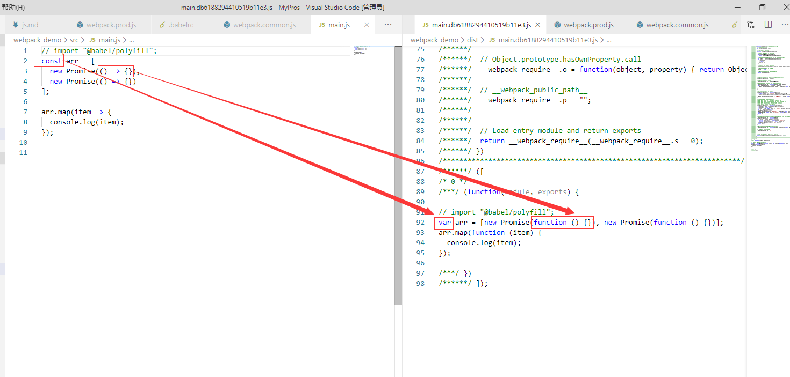
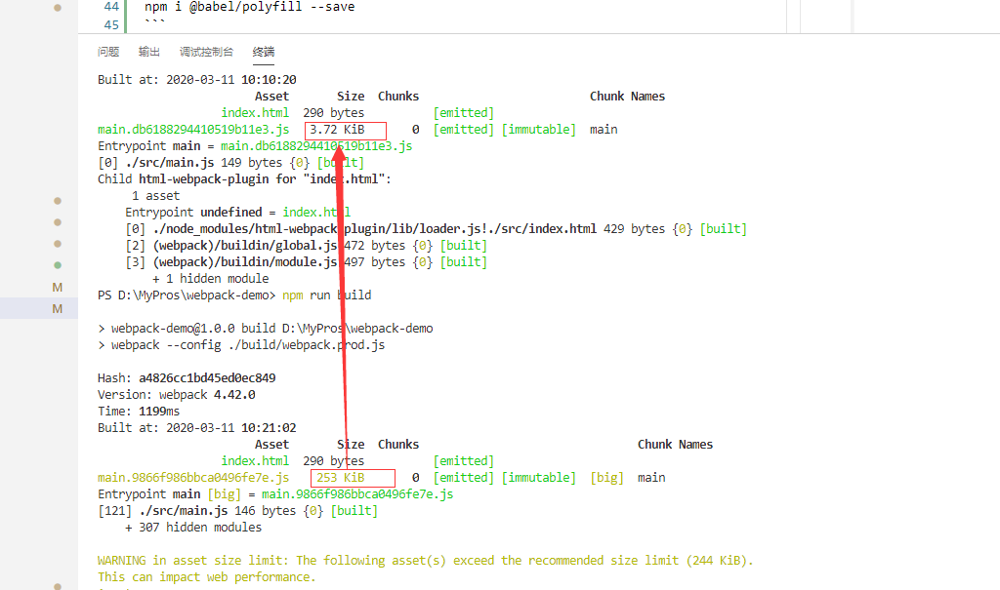
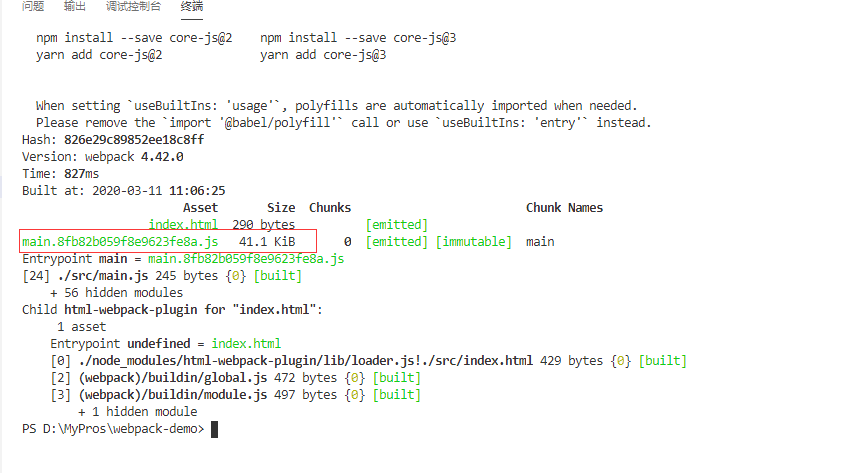

# js 文件的处理

## 使用 babel 转译 js 文件

安装依赖

```
npm install --save-dev babel-loader @babel/core @babel/preset-env
```

无论线上还是线下都需要对 js 文件进行转译，所以 js 文件处理应该放在通用配置中，配置内容如下。

```
{
    test: /\.js$/,
    use: {
        loader: 'babel-loader',
        options: {
            presets: ['@babel/preset-env']
        }
    },
    exclude: /node_modules/
}
```

`include`哪个文件下的 js 代码需要 babel 处理

`exclude`忽略掉哪个文件夹下的 js 文件

`.babelrc`是 webpack 中 babel 插件默认的配置文件，可以将 babel 对 js 的处理规则单独写在这个文件中，减少 webpack 配置的代码量更容易阅读。

在入口文件中写一段 es6 语句，然后执行打包，将打包好的文件内容与入口文件进行对比

<div align=center>
	
</div>

可以看到打包后 const 被翻译成 var,箭头函数被翻译成普通函数。但是 Promise 和 map 这些高级语法中的函数却依然保留，但低版本浏览器并不支持这些函数，因此需要使用 babel 的一个库将这些缺失的函数添加进去。

这个库在线上环境也要使用因此要安装在线上环境下。

```
npm i @babel/polyfill --save
```

在入口函数中引入这个库

```
import "@babel/polyfill";
```

再执行打包，可以看到第二次打包的主文件比上次大了很多。那是因为这个库将 es5 中缺省的函数以 es5 的语法进行了实现并引入

<div align=center>
	
</div>

但目前是将所有的方法全部引入，无用实际代码中是否用到。可以通过配置 useBuiltIns 实现按需加载，配置内容如下

```
{
  "presets": [
    [
      "@babel/preset-env",
      {
        "useBuiltIns": "usage",
        "corejs": 2
      }
    ]
  ]
}
```

再次打包后即可发现文件小了很多,也无需引入@babel/polyfill。

<div align=center>
	
</div>
用到的插件及作用

::: tip babel-loader
webpak 与 babel 进行通信用的插件，webpack 本身虽然能对 js 文件进行处理，但不具备将 es6 语法翻译成 es5 的能力。

[官网参考](https://webpack.docschina.org/loaders/babel-loader/)

:::

::: tip @babel/core
当 webpack 使用 babel-loader 处理文件时，babel-loader 实际上调用了 babel-core 的 api，因此也必须安装 babel-core.

[官网参考](http://babel.docschina.org/docs/en/babel-core#docsNav)
:::

::: tip @babel/preset-env
告诉 babel 使用哪种转码规则进行文件处理。

[官网参考](http://babel.docschina.org/docs/en/babel-preset-env)
:::

::: tip @babel/polyfill
Babel 默认只转换新的 JavaScript 句法（syntax），而不转换新的 API，比如 Iterator、Generator、Set、Maps、Proxy、Reflect、Symbol、Promise 等全局对象，以及一些定义在全局对象上的方法（比如 Object.assign）都不会转码。

举例来说，ES6 在 Array 对象上新增了 Array.from 方法。Babel 就不会转码这个方法。如果想让这个方法运行，必须使用 babel-polyfill，为当前环境提供一个垫片。

[官网参考](http://babel.docschina.org/docs/en/babel-polyfill#docsNav)
:::

## 使用eslint规范化代码

安装依赖
```
 npm install eslint-loader --save-dev
```

修改对js的处理规则如下
```
{
    test: /\.js$/,
    use: ["babel-loader", "eslint-loader"],
    exclude: /node_modules/
}
```

[官网参考](https://webpack.docschina.org/loaders/eslint-loader/)