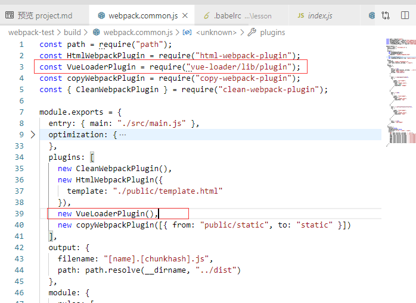
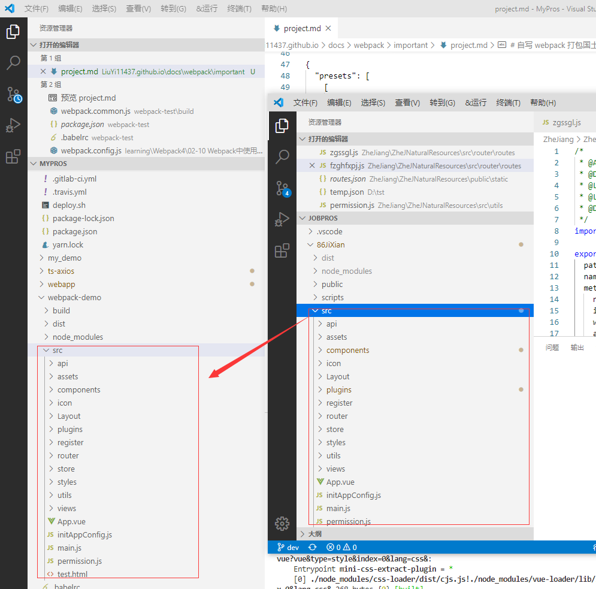
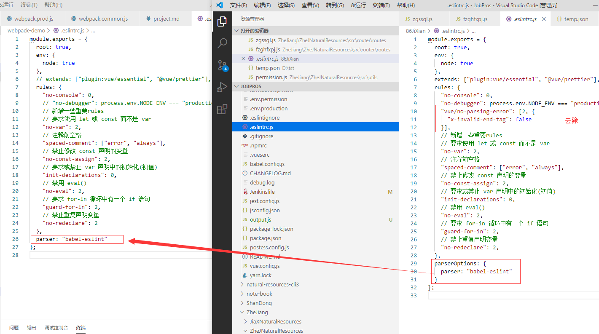
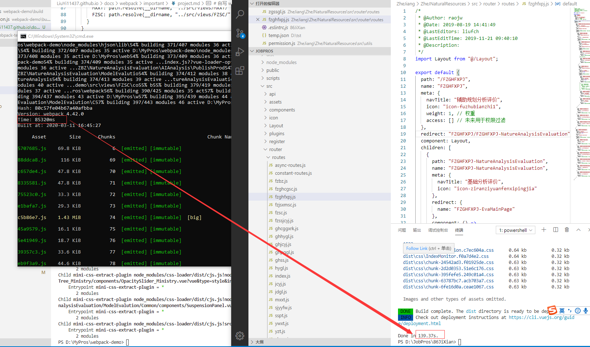
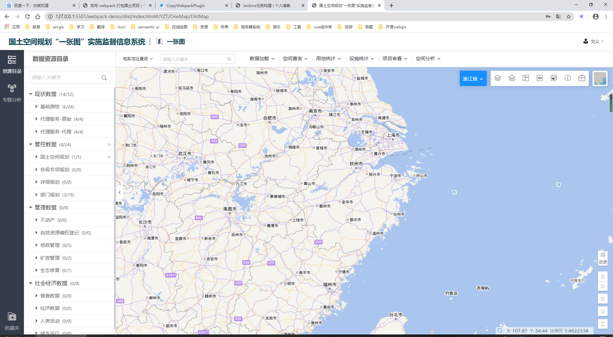

# 自写 webpack 打包国土项目

## 处理 vue 文件

安装依赖

```
npm i vue-loader vue-template-compiler --save-dev
```

添加对 vue 文件的处理规则

```
{
    test: /\.vue$/,
    loader: "vue-loader"
}
```

安装 eslint vue 代码检查插件

```
npm i eslint-plugin-vue --save-dev
```

::: warning 注意
除了添加对 vue 文件的处理规则还需要，引入并使用 VueLoaderPlugin 这个插件。

<div align=center>
	
</div>
:::

## 支持 jsx 语法

很多时候我们会在 js 中写 render 函数渲染页面，但 render 函数中的 jsx 语法 babel 并不认识导致打包出错，因此需要 js 文件中支持 jsx 的语法。

安装依赖

```
npm i babel-helper-vue-jsx-merge-props babel-plugin-transform-vue-jsx babel-plugin-syntax-jsx --save-dev
```

修改 babel 配置如下

```
{
  "presets": [
    [
      "@babel/preset-env",
      {
        "useBuiltIns": "usage",
        "corejs": 2
      }
    ]
  ],
  "plugins": ["transform-vue-jsx"]
}

```

[插件参考](https://www.npmjs.com/package/babel-plugin-transform-vue-jsx)

## 集成公司的业务代码

将我们用于测试的 src 目录删除，将基线的 src 拷贝到我们项目的目录下

<div align=center>
	
</div>

拷贝公司项目中用到的线上环境的依赖到我们的测试环境中,执行命令`npm install`安装依赖

在公共配置中添加 resolve 配置如下

```
resolve: {
    extensions: [".js", ".json", ".vue"],
    alias: {
      "@": path.resolve(__dirname, "../src/"),
      YZT: path.resolve(__dirname, "../src/views/YZT/"),
      JDGL: path.resolve(__dirname, "../src/views/JDGL/"),
      FZBZ: path.resolve(__dirname, "../src/views/FZBZ/"),
      JCYJ: path.resolve(__dirname, "../src/views/JCYJ/"),
      ZBMX: path.resolve(__dirname, "../src/views/ZBMX/"),
      YWXT: path.resolve(__dirname, "../src/views/YWXT/"),
      MXXT: path.resolve(__dirname, "../src/views/MXXT/"),
      FZSC: path.resolve(__dirname, "../src/views/FZSC/")
    }
  }
```

`extensions`：自动解析确定的扩展。导入后缀在配置中的文件时不用加后缀名

`alias`：创建 import 或 require 的别名，来确保模块引入变得更简单。

[官网参考](https://webpack.docschina.org/configuration/resolve/#resolve-alias)

::: warning 警告
如果要使用国土项目的.eslintrc.js 文件，拷贝过来后需要修改以下配置，如果打包失败可能是依赖缺失，请检查依赖。
:::

<div align=center>
	
</div>


执行打包与基线打包效率对比可以看到用最新的webpack打包在效率上比基线快了很多

<div align=center>
	
</div>

最后通过copyWebpackPlugin插件，将配置文件拷贝到打包后的文件中。
```
npm i copy-webpack-plugin --save-dev
```

使用该插件
```
new copyWebpackPlugin([{ from: "public/static", to: "static" }])
```

[插件参考](https://webpack.docschina.org/plugins/copy-webpack-plugin/)

最后在网页中查看打包好的系统，可以看到功能都正常。

<div align=center>
	
</div>
